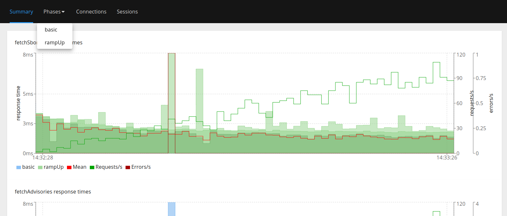
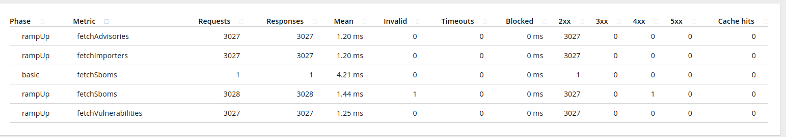

# Basic performance test with hyperfoil (in-vm) and PM-mode

* Open a terminal and run [PM-mode](../README.md#quick-start) with **UI** `cargo run --bin trustd`
* Open other terminal and run hyperfoil:

```shell
cd bench
./get-hf.sh
cd hyperfoil*/
./bin/cli.sh
```

> [!NOTE]
> Change from `-Djava.net.preferIPv4Stack=true` to `-Djava.net.preferIPv4Stack=false` in `hyperfoil*/bin/parse-opts.sh` see: <https://github.com/Hyperfoil/Hyperfoil/issues/346>

```shell
./bin/cli.sh
```

Run the following commands inside hyperfoil (in-vm):

```shell
start-local
upload ../pm-mode-hf.yml
run
stats
```

We can see something like:

```shell
[hyperfoil@in-vm]$ upload ../pm-mode-hf.yml
Loaded benchmark pm-mode, uploading...
... done.
[hyperfoil@in-vm]$ run
Started run 0003
Run 0003, benchmark pm-mode
Agents: in-vm[STOPPED]
Started: 2024/05/16 14:32:27.744    Terminated: 2024/05/16 14:33:27.754
NAME    STATUS      STARTED       REMAINING  COMPLETED     TOTAL DURATION               DESCRIPTION
basic   TERMINATED  14:32:27.745             14:32:27.757  12 ms (exceeded by 13 ms)    1 users at once
rampUp  TERMINATED  14:32:27.745             14:33:27.754  60009 ms (exceeded by 9 ms)  1.00 - 100.00 users per second
[hyperfoil@in-vm]$ stats
Total stats from run 0003
PHASE   METRIC                THROUGHPUT   REQUESTS  MEAN     p50      p90      p99      p99.9    p99.99    TIMEOUTS  ERRORS  BLOCKED  2xx   3xx  4xx  5xx
                              CACHE
----------------------------------------------------------------------------------------------------------------------------------------------------------------
basic   fetchSboms            83.33 req/s         1  4.21 ms  4.23 ms  4.23 ms  4.23 ms  4.23 ms   4.23 ms         0       0     0 ns     1    0    0    0
                                        0
----------------------------------------------------------------------------------------------------------------------------------------------------------------
rampUp  fetchAdvisories       50.44 req/s      3027  1.20 ms  1.36 ms  1.64 ms  2.38 ms  4.06 ms  11.80 ms         0       0     0 ns  3027    0    0    0
                                        0
----------------------------------------------------------------------------------------------------------------------------------------------------------------
rampUp  fetchImporters        50.44 req/s      3027  1.20 ms  1.36 ms  1.71 ms  2.33 ms  3.21 ms  11.60 ms         0       0     0 ns  3027    0    0    0
                                        0
----------------------------------------------------------------------------------------------------------------------------------------------------------------
rampUp  fetchSboms            50.46 req/s      3028  1.44 ms  1.56 ms  1.95 ms  2.56 ms  4.06 ms  10.62 ms         0       0     0 ns  3027    0    1    0
                                        0
----------------------------------------------------------------------------------------------------------------------------------------------------------------
rampUp  fetchVulnerabilities  50.44 req/s      3027  1.25 ms  1.43 ms  1.70 ms  2.21 ms  2.95 ms   4.26 ms         0       0     0 ns  3027    0    0    0
                                        0
----------------------------------------------------------------------------------------------------------------------------------------------------------------
[hyperfoil@in-vm]$
```

Now run the `report` command:

```shell
[hyperfoil@in-vm]$ report --destination=/whatever_dir_here
```

A browser will pop up and show this:

(you can visualize more options on browser report)




