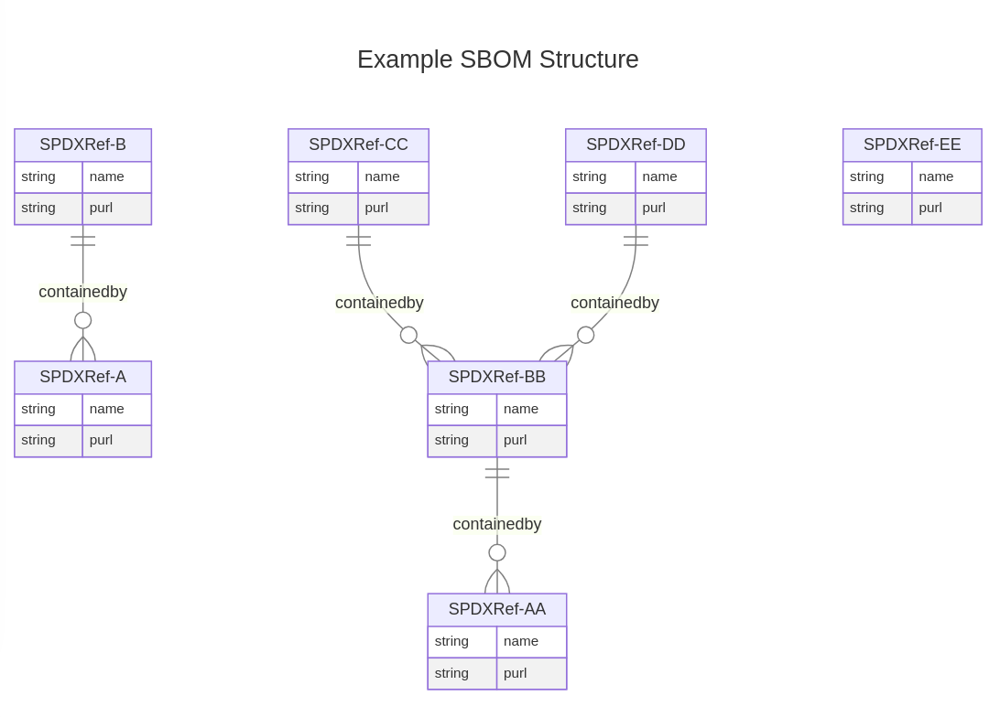

# 00001. Graph Analytics in Trustify

Date: 2024-08-26

## Status

Accepted

## Context

This ADR is concerned with how we might answer the following questions: 

**_Which 'package' should I (engineer) fix ?_**

This roughly translates to:

1) Find a component(s) by its purl, name or glob/regex
2) Resolve each component(s) ancestors
3) The top most ancestor will be its root component

Product security engineers often do not know the fully qualified component name and will need to 'glob' search on some string to 
ensure they retrieve all related components.

For example,



has 3 root components (A,AA,EE) ... querying from the context of any other node should resolve to the appropriate root component.


**_I (user) want to know which 'products' contains a component ?_**

This roughly translates to:

1) Find a component(s) by its purl, name or glob/regex
2) Resolve each component(s) ancestors
3) The top most ancestor will be its root component
4) Determine product relationship of the root component(s)

### Requirements

* Given a component/package determine its ancestor components in dependency tree (aka root component(s)).
* Given a component/package determine its ancestor components in dependency tree (aka root component(s)) and determine their product relationships.

## Process flow

Graphs will be loaded 'lazily' eg. when they are requested:

1) retrieve list of _latest_ unique sbom ids searched by like or exact name. 
2) Using unique sbom ids, filter query package_relates_to_package (resolving left and right ID purl strings)
3) load into write locked hashmap<petgraph>, where the key is the sbom_id

We can easily 'prime' the loading of graphs either by programmatically invoking service load_graphs() (from say importing and ingesting an sbom) or
indirectly by running a series of HTTP requests.

Once a graph is loaded then query is
1) retrieve list of _latest_ unique sbom ids searched by like or exact name.
2) read only access on hashmap<petgraph>, looping through petgraphs performing ancestor node search
3) serialise results to REST API

## Decision

Generate a read only graph, using petgraph, which describes dependency relationships between components.

Each node of the graph will contain:
* component pURL
* component name
* published 

With the following possible edge relationships between components:
* ContainedBy
* GeneratedFrom
* PackageOf

Expose a set of REST API endpoints

**Retrieve a component(s) root component**
HTTP GET api/v1/analysis/root-component?q={}
HTTP GET api/v1/analysis/root-component/{component-name}
HTTP GET api/v1/analysis/root-component/{component-purl}

all of the above should return paginated lists:

```json
{"total" : 2,
{
  "items": [
    {
      "sbom_id": "0191d750-49a2-72b2-bf1a-f7c6ae792518",
      "node_id": "SPDXRef-3d373f74-e7e5-4c41-90d9-b29d5a7e2312",
      "purl": "pkg://oci/sandboxed-containers-operator-bundle@sha256:ff2bb666c2696fed365df55de78141a02e372044647b8031e6d06e7583478af4?arch=x86_64&repository_url=registry.redhat.io/openshift/sandboxed-containers-operator-bundle&tag=1.2.0-24",
      "name": "sandboxed-containers-operator-bundle",
      "published": "2024-08-06 05:28:39+00",
      "document_id": "https://access.redhat.com/security/data/sbom/spdx/OSE-OSC-1.2.0-RHEL-8",
      "product_name": "OSE-OSC-1.2.0-RHEL-8",
      "product_version": "1-2",
      "ancestors": [
        {
          "sbom_id": "0191d750-49a2-72b2-bf1a-f7c6ae792518",
          "node_id": "SPDXRef-440459d0-4240-4ac9-844f-2fd6b3d37429",
          "purl": "pkg://oci/sandboxed-containers-operator-bundle@sha256:782313f2b91c115191593b8b63e10f5e30cf87f6c2d15618d6bfa359f51de947?repository_url=registry.redhat.io/openshift/sandboxed-containers-operator-bundle&tag=1.2.0-24",
          "name": "sandboxed-containers-operator-bundle"
        }
      ]
    },
    {
      "sbom_id": "0191d750-49a2-72b2-bf1a-f7c6ae792518",
      "node_id": "SPDXRef-440459d0-4240-4ac9-844f-2fd6b3d37429",
      "purl": "pkg://oci/sandboxed-containers-operator-bundle@sha256:782313f2b91c115191593b8b63e10f5e30cf87f6c2d15618d6bfa359f51de947?repository_url=registry.redhat.io/openshift/sandboxed-containers-operator-bundle&tag=1.2.0-24",
      "name": "sandboxed-containers-operator-bundle",
      "published": "2024-08-06 05:28:39+00",
      "document_id": "https://access.redhat.com/security/data/sbom/spdx/OSE-OSC-1.2.0-RHEL-8",
      "product_name": "OSE-OSC-1.2.0-RHEL-8",
      "product_version": "1-2",
      "ancestors": []
    },
  ....
  ]
}
```

where ancestors contain purl, name, published and document_id which answers our questions.

**Retrieve a component(s) dependencies**
HTTP GET api/v1/analysis/dep?q={}
HTTP GET api/v1/analysis/dep/{component-name}
HTTP GET api/v1/analysis/dep/{component-purl}

```json
{
  "items": [
    {
      "sbom_id": "0191d750-49a2-72b2-bf1a-f7c6ae792518",
      "node_id": "SPDXRef-3d373f74-e7e5-4c41-90d9-b29d5a7e2312",
      "purl": "pkg://oci/sandboxed-containers-operator-bundle@sha256:ff2bb666c2696fed365df55de78141a02e372044647b8031e6d06e7583478af4?arch=x86_64&repository_url=registry.redhat.io/openshift/sandboxed-containers-operator-bundle&tag=1.2.0-24",
      "name": "sandboxed-containers-operator-bundle",
      "published": "2024-08-06 05:28:39+00",
      "document_id": "https://access.redhat.com/security/data/sbom/spdx/OSE-OSC-1.2.0-RHEL-8",
      "product_name": "OSE-OSC-1.2.0-RHEL-8",
      "product_version": "1-2",
      "deps": []
    },
    {
      "sbom_id": "0191d750-49a2-72b2-bf1a-f7c6ae792518",
      "node_id": "SPDXRef-440459d0-4240-4ac9-844f-2fd6b3d37429",
      "purl": "pkg://oci/sandboxed-containers-operator-bundle@sha256:782313f2b91c115191593b8b63e10f5e30cf87f6c2d15618d6bfa359f51de947?repository_url=registry.redhat.io/openshift/sandboxed-containers-operator-bundle&tag=1.2.0-24",
      "name": "sandboxed-containers-operator-bundle",
      "published": "2024-08-06 05:28:39+00",
      "document_id": "https://access.redhat.com/security/data/sbom/spdx/OSE-OSC-1.2.0-RHEL-8",
      "product_name": "OSE-OSC-1.2.0-RHEL-8",
      "product_version": "1-2",
      "deps": [
        {
          "sbom_id": "0191d750-49a2-72b2-bf1a-f7c6ae792518",
          "node_id": "SPDXRef-3d373f74-e7e5-4c41-90d9-b29d5a7e2312",
          "purl": "pkg://oci/sandboxed-containers-operator-bundle@sha256:ff2bb666c2696fed365df55de78141a02e372044647b8031e6d06e7583478af4?arch=x86_64&repository_url=registry.redhat.io/openshift/sandboxed-containers-operator-bundle&tag=1.2.0-24",
          "name": "sandboxed-containers-operator-bundle",
          "deps": []
        }
      ]
    },
    {
      "sbom_id": "0191d750-49a2-72b2-bf1a-f7c6ae792518",
      "node_id": "SPDXRef-6447af1f-4faa-481a-a1e6-90ecbb6ab631",
      "purl": "pkg://github/openshift/sandboxed-containers-operator@9b5eef5d49a967ba3240f01a2cb4476c44f1f66e",
      "name": "sandboxed-containers-operator",
      "published": "2024-08-06 05:28:39+00",
      "document_id": "https://access.redhat.com/security/data/sbom/spdx/OSE-OSC-1.2.0-RHEL-8",
      "product_name": "OSE-OSC-1.2.0-RHEL-8",
      "product_version": "1-2",
      "deps": [
        {
          "sbom_id": "0191d750-49a2-72b2-bf1a-f7c6ae792518",
          "node_id": "SPDXRef-0b155bf3-15cc-4353-9e47-58b722ed067e",
          "purl": "pkg://oci/osc-must-gather-container@sha256:97c02ff2227bb56c2edeb37f674db11ebd0a5ab63897b64e852d7db11163e1ba?repository_url=registry.redhat.io/openshift-sandboxed-containers-operator-must-gather&tag=1.2.0-11.1655140658",
          "name": "osc-must-gather-container",
          "deps": [
            {
              "sbom_id": "0191d750-49a2-72b2-bf1a-f7c6ae792518",
              "node_id": "SPDXRef-ff914a27-712b-4e23-8074-f530f0fa2eca",
              "purl": "pkg://golang/github.com/pmezard/go-difflib@v1.0.0",
              "name": "go-difflib",
              "deps": []
            },
            {
              "sbom_id": "0191d750-49a2-72b2-bf1a-f7c6ae792518",
              "node_id": "SPDXRef-ff198394-86b5-4cf5-a58f-da0ef9b516e3",
              "purl": "pkg://golang/k8s.io/api/admissionregistration/v1@v0.22.1",
              "name": "v1",
              "deps": []
            },
            {
              "sbom_id": "0191d750-49a2-72b2-bf1a-f7c6ae792518",
              "node_id": "SPDXRef-ff086cd5-146b-442f-85a7-2a1c84767ab9",
              "purl": "pkg://rpm/redhat/crypto-policies@20211116-1.gitae470d6.el8?arch=noarch",
              "name": "crypto-policies",
              "deps": []
            },
            {
              "sbom_id": "0191d750-49a2-72b2-bf1a-f7c6ae792518",
              "node_id": "SPDXRef-fe93b41a-ebab-48b5-813b-60307b4a711d",
              "purl": "pkg://rpm/redhat/openldap@2.4.46-18.el8?arch=x86_64",
              "name": "openldap",
              "deps": []
            },
            ...
          ]
}
```

## Alternative approaches

We could query existing package_relates_to_package to resolve relationships though previous attempts with a pure SQL based
solution often experienced performance problems either due to 'join explosion' or need to constantly tweak indexes to accomodate 
performance of joins at scale.

We could use a graph datastore ... which dramatically simplifies everything as well as improving performance by at least a 
magnitude - though previous attempts have shown (especially at scale) that we need to either wait for postgres to natively 
support property graphs (as part of the new SQL standard) or use a commercial service (such as AWS neptune, Progress marklogic)
as there are currently no open source offerings that are fit for purpose (or available as part of our internal IT offerings). 
Using a graph database would also dramatically improve any kind of maintenance tasks for mutating or updating graph data directly.

## Consequences

We assume sbom data correctly enumerates dependency relationships - no attempt is made to 'fix up' (either at ingestion or query time)
with respect to generated read only graph. 

We assume equivalent Sbom SPDXID, across documents, imply equivalent pURL (aka component).

We assume Sbom SPDX identifiers are stable across multiple versions of the same document_id.

We assume products do not 'span' across multiple SBOM documents but that may not always be the case in the future.

Employing a read only graph avoids the challenges of having to maintain such a graph with inserts or updates (without a graph 
datastore this is always slow...).

We are mostly interested in answering these questions in the current context which implies the _maximum_ graph should only ever contain
relationships as defined in latest version of SBOMs. Answering this question in a historical context is out of scope (possible 
but much more complicated).

Performance is limited by the fact we bespoke build a graph for each query ... we should optimise this approach by having
a graph always available (loaded with latest version SBOM relationships) either as a single graph or a hashmap<graph> (containing
a graph per sbom).

Loading and interrogating an 'in memory' graph has resource implications - it might be that this analytics process, at scale, will
need processing to be isolated (for example, as separate pod(s) in openshift). We might also have to consider connection specific
postgres configuration (and/or connect to a dedicated read only postgres replica).

The default performance profile of graphmap should be biased toward multiple concurrent read access - loading graph into a hashmap will lock it.

It should be possible to parallise the loading and querying of multiple graphs in hashmap.

It should be possible to use https://crates.io/crates/lru to limit number of graphs in hashmap.