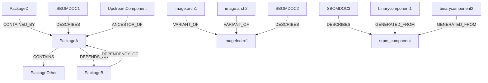
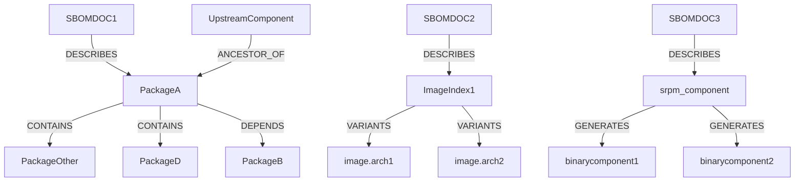

# 00002. Analysis graph API in Trustify

Date: 2025-01-23

## Status

ACCEPTED

## Context

This ADR is an addenda to [previous ADR](00001-graph-analytics.md) as an attempt to clarify the differences between the graph
relationships we capture and the view we want to create from the forest of graphs.

Ingesting an sbom captures a set of trustify relationships, which are instantiated
in the forest of graphs as;



Trustify relationships attempt to put an abstraction over relationships 
defined by any format of sbom (eg. cyclonedx, spdx). 

This graph encapsulates provenance of sbom relationship though end users are unlikely 
to directly navigate such graphs, as it would mean forcing concrete understanding of relationship directionality. 
If we were to _normalise_ all relationships (similar to the rewrite of all CONTAINS into CONTAINED_BY) the 
resultant DAG is probably ok ex. we could rewrite the following relationships:

  [ _binarycomponent1_ **GENERATED_FROM** _srpm_component_] to [_srpm_component_ **GENERATES** _binarycomponent1_]

  [ _image.arch2_ **VARIANT_OF** _ImageIndex1_] to [_ImageIndex1_ **VARIANTS** _image.arch2_]

So while we make the logical model easier to comprehend it is a good practice to keep logical model separate and not try to overload that model to serve as conceptual model.

The `api/v2/analysis` endpoints are responsible for building up the conceptual view. Where we want to query, filter and
traverse on the following.



It is a feature that this conceptual model spans beyond traversal of just transitive software dependencies.  

For example, searching for any node in above view, should let us traverse ancestors and descendents ... a 
few illustrative examples:

**Search for 'PackageA'**
* component ancestors would be `[UpstreamComponent]`
* component descendents would be the tree underneath 'PackageA' `[PackageOther,PackageD,PackageB]`

**Search for 'image.arch1'**
* component ancestors would be `[ImageIndex1]`
* component descendents would be `[]`

_Note: every node in the graph already knows its relationship to original SBOM so no need
to enumerate DESCRIBES relationship ... though in the future we may see other artifacts (eg. sbom) 
DESCRIBES._

We should make it easy to visualise this conceptual model direct from the endpoints (ex. Accept: image/svg 
would pull down an svg representation).

## Decision

### Implement `api/v2/analysis/component`

payload returns immediate ancestor/descendent relations (eg. 'one deep')
```json
{
  "sbom_id": "",
  "node_id": "",
  "purl": [
    ""
  ],
  "cpe": [],
  "name": "PackageA",
  "version": "",
  "published": "2024-12-19 18:04:12+00",
  "document_id": "urn:uuid:537c8dc3-6f66-3cac-b504-cc5fb0a09ece",
  "product_name": "",
  "product_version": "",
  "ancestor": [
    {
      "sbom_id": "",
      "node_id": "",
      "relationship": "AncestorOf",
      "purl": [
        ""
      ],
      "cpe": [],
      "name": "UpstreamPackage",
      "version": ""
    }
  ],
  "descendent": [
    { 
      "sbom_id": "",
      "node_id": "",
      "relationship": "Variants",
      "purl": [
        ""
      ],
      "cpe": [],
      "name": "PackageC",
      "version": ""
    }
  ]
}
}
```

Where items in `ancestor` array imply _Ancestor component_ VIEWRELATION _Searched component_ ... in the above example that would 
mean _UpstreamPackage_ **AncestorOf** _PackageA_

Where items in `descendent` array imply _Searched component_ VIEWRELATION _Descendent component_ ... in the above example that would
mean _PackageA_ **Variants** _PackageC_

This endpoint provides the following url params with the following defaults
- anc_depth=1
- desc_depth=1
- relationshipType=*

### Implement `api/v2/analysis/ancestor`
  payload returns all ancestor relations
```json
{
  "sbom_id": "",
  "node_id": "",
  "purl": [
    ""
  ],
  "cpe": [],
  "name": "",
  "version": "",
  "published": "2024-12-19 18:04:12+00",
  "document_id": "urn:uuid:537c8dc3-6f66-3cac-b504-cc5fb0a09ece",
  "product_name": "",
  "product_version": "",
  "ancestor": [
    {
      "sbom_id": "",
      "node_id": "",
      "relationship": "AncestorOf",
      "purl": [
        ""
      ],
      "cpe": [],
      "name": "",
      "version": ""
    }, {} ....
  ]
}
```

The `ancestor` array contains a list of ancestors with the last item
in the list being considered the _root component_.

This is equiv to
- anc_depth=*
- desc_depth=0
- relationshipType=*

### Implement `api/v2/analysis/descendent`
returns all descendent relations
```json
{
  "sbom_id": "",
  "node_id": "",
  "purl": [
    ""
  ],
  "cpe": [],
  "name": "",
  "version": "",
  "published": "2024-12-19 18:04:12+00",
  "document_id": "urn:uuid:537c8dc3-6f66-3cac-b504-cc5fb0a09ece",
  "product_name": "",
  "product_version": "",
  "descendent": [
    {
      "sbom_id": "",
      "node_id": "",
      "relationship": "Variants",
      "purl": [
        ""
      ],
      "cpe": [],
      "name": "",
      "version": "",
      "descendent": [{} ....]
    }, {} ....
  ]
}
```
The `descendent` array contains a list of descendents with each component also containing any nested descendents.

This is equiv to
- anc_depth=0
- desc_depth*
- relationshipType=*

### Implement `api/v2/analysis/relationship`

Provide an experimental interface using relationship view.

TBA

### Implement visualisation

Generation of a high quality svg
Generation of mermaid represenation

### Document analysis graph API

Openapi definitions should provide good REST API level documentation.

Additional sections should be added to docs/book 

## Alternative approaches

**Directly use graphs:** It is likely that we will provide raw interface to the graphs (aka `api/v2/analysis/relationship`) though
we do not want to move responsibility of building up the 'view' to a client so still need to provide the other endpoints for that.

**Build a new graph representing the conceptual model:** As graphs do not mutate, its not so far fetched to
consider additionally generating a conceptual graph. It might be something we consider as an optimisation in 
the future though for now thinking it would be good to avoid the cost (ram, memory). The conceptual graph model might be 
considered a replacement for logical model though that would be flawed thinking as we always need the logical 
model to tell us relationship provenance eg. the logical model is absolutely required.

## Consequences

* We need to identify all the relationships that are candidates for rewrites into DAG (ex. DEPENDENCY_OF to DEPENDS_ON)
* Having a clear conceptual model will reduce cognitive load of having to mentally reparse graph relations
* A DAG based conceptual model means we can also do neat stuff like generate visual representations (mermaid, svg, etc)
* In the future we can have a graphql interface directly on the graph.
* Cache invalidation, partitioning and general memory use will need some deeper thought - in the recent past
we have discussed the use of LRU on the graph hashmap which probably addresses any immediate need.
