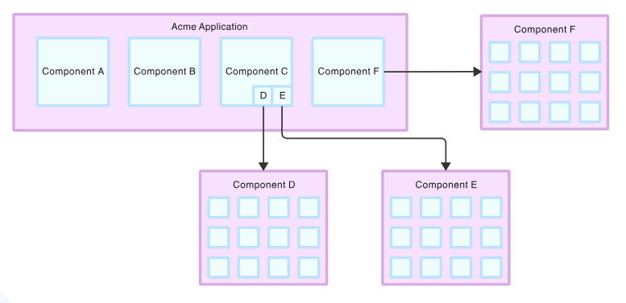
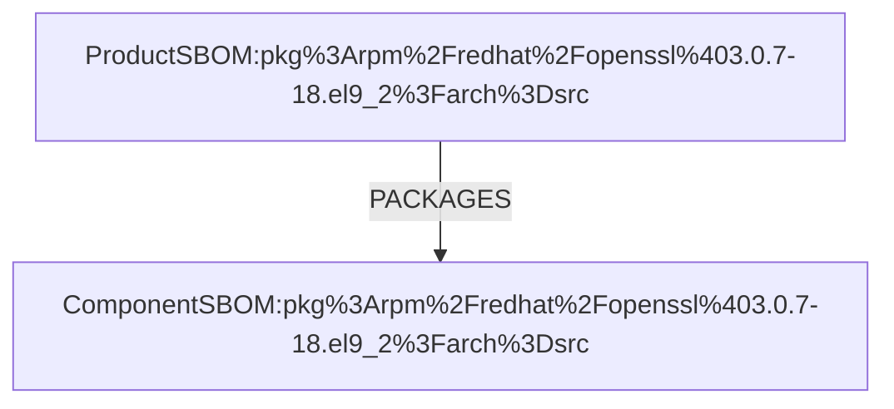

# 00003. References to external SBOMs

Date: 2025-01-24

## Status
ACCEPTED

## Context

Using spdx and cdx formats, we want to enable an SBOM to be able to denote relationships between its own packages with 
packages/components contained in another SBOM.



This is not just a feature for managing complex distributions of SBOMs but also allows the extension of _authority_ of an 
originating SBOM enhancing relationships against packages in other SBOMs. 

While this _authority_ only applies in one direction (from original SBOM to external SBOM) we will want to be able to query
in both directions. For example:
* given package in origin SBOM we should be able to query for descendant(s) contained in external SBOM
* given any package in external SBOM we should be able to find ancestor(s) contained in origin SBOM

### SPDX  
For SPDX, external documents are denoted in an `externalDocumentRefs` element.

```json
{
  "SPDXID": "SPDXRef-DOCUMENT",
  "SPDXVersion": "SPDX-2.3",
  "dataLicense": "CC0-1.0",
  "documentNamespace": "http://spdx.org/spdxdocs/example-sbom-1.0",
  "documentName": "Example SBOM",
  "packages": [
    {
      "name": "PackageA",
      "SPDXID": "SPDXRef-PackageA",
      "versionInfo": "3.8.1",
      "originator": "Organization: JUnit",
      "downloadLocation": "NOASSERTION",
      "filesAnalyzed": false,
      "homepage": "http://example.org",
      "licenseConcluded": "NOASSERTION",
      "licenseDeclared": "CPL-1.0",
      "copyrightText": "UNSPECIFIED",
      "summary": "",
      "description": ""
    }
  ],
  "externalDocumentRefs": [
    {
      "externalDocumentRef": "SPDXRef-OtherPackages",
      "spdxDocument" : "http://spdx.org/spdxdocs/another-sbom-1.0",
      "documentName": "Another SBOM",
      "checksum" : {
        "algorithm" : "SHA1",
        "checksumValue" : "f2d13e3f9deeef2e3aefdc216f5c4ebb0eb4b152"
      },
      "documentVersion": "1.0",
      "comment": "PackageB is defined in this external SBOM."
    }
  ],
  "relationships": [
    {
      "RelationshipType": "DEPENDS_ON",
      "RelatedSpdxElement": "SPDXRef-OtherPackages:SPDXRef-PackageB",
      "SpdxElement": "SPDXRef-PackageA"
    }
  ]
}
```
This SBOM asserts a relationship to a package in another SBOM ( _SPDXRef-PackageA_ **DEPENDS_ON** _SPDXRef-OtherPackages:SPDXRef-PackageB_) - which should not be considered bi-directional eg the 'authority' of 
this SBOM is germane to the original SBOM.

A few other spdx `externalDocumentRefs` examples:
* https://github.com/spdx/spdx-examples/blob/7173f3148dc8a0fdf9397e676611b1e3cd116c66/software/example14/spdx2.3/examplemaven-0.0.1-enriched.spdx.json#L17
* https://github.com/spdx/spdx-examples/blob/master/software/example7/spdx2.2/example7-bin.spdx.json

Using the following properties of spdx SBOM:
- **externalDocumentRef**: brings in components from external namespace
- **spdxDocument**: concat with SPDXID is addressing mechanism 
- **checksum**: external document's Checksum/digest/hash ensuring unique match

We should be able to provide an unambiguous internal mapping from with which to locate and relate a package in an external SBOM.

When a checksum is not directly embedded in the `externalDocumentRef` we can assist the heuristic by using an externally 
generated checksum (though taking care that this checksum is generated on the invariant document itself).

### CycloneDX

In cyclonedx, the main mechanism for cross referencing against an external SBOM is the use of `bom-link`:
```json
{
  "bomFormat": "CycloneDX",
  "specVersion": "1.6",
  "version": 1,
  "metadata": {
    "timestamp": "2025-01-27T08:24:31Z",
    "tools": [
      {
        "vendor": "Example Vendor",
        "name": "Example Tool",
        "version": "1.0.0"
      }
    ],
    "authors": [
      {
        "name": "Jim Fuller",
        "email": "jim.fuller@example.com"
      }
    ],
    "component": {
      "type": "application",
      "name": "Example Application",
      "version": "1.0.0",
      "bom-ref": "application-1.0.0"
    }
  },
  "components": [
    {
      "type": "library",
      "name": "Example Application",
      "version": "2.0.0",
      "bom-ref": "app-2.0.0",
    }
  ],
  "dependencies": [
    {
      "ref": "app-2.0.0",
      "dependsOn": [
        "urn:uuid:3e671687-395b-41f5-a30f-a58921a69b79/1.6#acme-application-1.0.0"
      ]
    }
  ],
  "externalReferences": [
    {
      "type": "spdx",
      "url": "https://example.org/other-sbom.json",
    },
  ],
}
```
The bom-link:

    `urn:uuid:3e671687-395b-41f5-a30f-a58921a69b79/1.6#acme-application-1.0.0`

refers to the external sbom (eg. "https://example.org/other-sbom.json") which maps to serialNumber and version and component (with bom-ref).
```json
{
  "bomFormat": "CycloneDX",
  "specVersion": "1.6",
  "serialNumber": "urn:uuid:3e671687-395b-41f5-a30f-a58921a69b79",
  "version": 1,
  "components": [
    {
      "bom-ref": "acme-application-1.0.0",
      "type": "application",
      "name": "Acme Application",
      "version": "1.0.0",
    },
```

When a checksum is not directly embedded in the SBOM we can assist the heuristic by using an externally generated checksum
(though taking care that this checksum is generated on the invariant document itself).

More information on SBOM linking with cyclonedx https://github.com/CycloneDX/guides/blob/68981da38d86487bc2e24532484e6a8128eea65f/SBOM/en/0x52-Linking.md

### Red Hat specific SBOMs

At Red Hat - **Build-time** SBOMs are created during the initial build of an artifact (for example, when an RPM is created 
from source files or a container image is built using buildah). These SBOMs document the components used during the build 
process to produce the final artifact as well as any components used for the build process itself. This SBOM type aligns 
with the **Build SBOM** type from **CISA**'s guidance on _Types of SBOM Documents_.

**Release-time** SBOMs are created when an artifact is released or published. These SBOMs are derived frombuild-time SBOMs by 
incorporating additional metadata, such as the repositories or locations where an artifact is published, and associating 
it with the relevant product information if there is any. Release-time SBOMs reflect the state of the software as it is 
distributed to end users. 

**Component-level** SBOMs (which is also a **Release-time** SBOM) describe an individual component, such as a single RPM 
package or a container image. They document the full listing of individual components, libraries, and other relevant software 
that went into building that component. Component-level SBOMs also include provenance metadata for certain components. For 
example, a component-level SBOM of an RPM will point to the upstream sources that that RPM is based on. 

**Product-level** SBOMs describe an entire product and the subset of its components that were built and included in the 
final product. A product-level SBOM may cover one or more component-level SBOMs, providing a way to connect each release 
component to its parent product.

Here is an example cdx product sbom:

```json
{
  "id": "496116CE816D4B1",
  "identifier": "RHSA-2025:0823-02#RHEL-8.8.0.Z.EUS",
  "creationTime": "2025-01-29T19:43:10.278015Z",
  "sbom": {
    "version": 1,
    "metadata": {
      "tools": {
        "components": [
          {
            "name": "SBOMer",
            "type": "application",
            "author": "Red Hat",
            "version": "562bd59f"
          }
        ]
      },
      "component": {
        "name": "Red Hat Enterprise Linux 8.8 Extended Update Support",
        "type": "operating-system",
        "bom-ref": "RHEL-8.8.0.Z.EUS",
        "version": "RHEL-8.8.0.Z.EUS",
        "evidence": {
          "identity": [
            {
              "field": "cpe",
              "concludedValue": "cpe:/o:redhat:rhel_eus:8.8::baseos"
            }
          ]
        },
        "supplier": {
          "url": [
            "https://www.redhat.com"
          ],
          "name": "Red Hat"
        }
      },
      "timestamp": "2025-01-29T19:42:59Z"
    },
    "bomFormat": "CycloneDX",
    "components": [
      {
        "name": "traceroute",
        "purl": "pkg:rpm/redhat/traceroute@2.1.0-8.el8_8?arch=src",
        "type": "library",
        "hashes": [
          {
            "alg": "SHA-256",
            "content": "4d3ffb71c97ce620b3b3cd912f677d3995b755dd9e02ba66957dd675526c34f9"
          }
        ],
        "bom-ref": "pkg:rpm/redhat/traceroute@2.1.0-8.el8_8?arch=src",
        "version": "2.1.0-8.el8_8",
        "evidence": {
          "identity": [
            {
              "field": "purl",
              "concludedValue": "pkg:rpm/redhat/traceroute@2.1.0-8.el8_8?arch=src&repository_id=rhel-8-for-ppc64le-baseos-eus-source-rpms__8_DOT_8"
            },
            {
              "field": "purl",
              "concludedValue": "pkg:rpm/redhat/traceroute@2.1.0-8.el8_8?arch=src&repository_id=rhel-8-for-s390x-baseos-eus-source-rpms__8_DOT_8"
            },
            {
              "field": "purl",
              "concludedValue": "pkg:rpm/redhat/traceroute@2.1.0-8.el8_8?arch=src&repository_id=rhel-8-for-x86_64-baseos-eus-source-rpms__8_DOT_8"
            },
            {
              "field": "purl",
              "concludedValue": "pkg:rpm/redhat/traceroute@2.1.0-8.el8_8?arch=src&repository_id=rhel-8-for-ppc64le-baseos-e4s-source-rpms__8_DOT_8"
            },
            {
              "field": "purl",
              "concludedValue": "pkg:rpm/redhat/traceroute@2.1.0-8.el8_8?arch=src&repository_id=rhel-8-for-aarch64-baseos-eus-source-rpms__8_DOT_8"
            },
            {
              "field": "purl",
              "concludedValue": "pkg:rpm/redhat/traceroute@2.1.0-8.el8_8?arch=src&repository_id=rhel-8-for-x86_64-baseos-e4s-source-rpms__8_DOT_8"
            },
            {
              "field": "purl",
              "concludedValue": "pkg:rpm/redhat/traceroute@2.1.0-8.el8_8?arch=src&repository_id=rhel-8-for-x86_64-baseos-tus-source-rpms__8_DOT_8"
            }
          ]
        },
        "licenses": [
          {
            "expression": "GPL-2.0-or-later"
          }
        ],
        "supplier": {
          "url": [
            "https://www.redhat.com"
          ],
          "name": "Red Hat"
        }
      }
    ],
    "specVersion": "1.6",
    "dependencies": [
      {
        "ref": "RHEL-8.8.0.Z.EUS",
        "provides": [
          "pkg:rpm/redhat/traceroute@2.1.0-8.el8_8?arch=src"
        ],
        "dependsOn": []
      }
    ],
    "serialNumber": "urn:uuid:0db3f41e-6e7f-384f-b555-1985798c4d5e"
  },
  "configIndex": 0,
  "generation": {
    "id": "CF8A36D144A644F",
    "identifier": "RHSA-2025:0823-02#RHEL-8.8.0.Z.EUS",
    "type": "BREW_RPM",
    "creationTime": "2025-01-29T19:43:04.620766Z",
    "status": "FINISHED",
    "result": "SUCCESS"
  }
}
```

This SBOM relates **RHEL-8.8.0.Z.EUS** with **pkg:rpm/redhat/traceroute@2.1.0-8.el8_8?arch=src**.

The existence of `evidence.identity` does not discriminate enough for us to identify a specific product sbom (we **MAY** ask 
prodsec to inject a bit more metadata). The `generation.identifier` of a product SBOM, for example **RHSA-2025:0823-02#RHEL-8.8.0.Z.EUS**,
MAY also be useful in identifying a product SBOM.

The component `pkg:rpm/redhat/traceroute@2.1.0-8.el8_8?arch=src` has a component checksum of **4d3ffb71c97ce620b3b3cd912f677d3995b755dd9e02ba66957dd675526c34f9** 
which can be used to _lookup_ `pkg:rpm/redhat/traceroute@2.1.0-8.el8_8?arch=src` in the component SBOM.

A fully fledged example:

```json
{
  "bomFormat": "CycloneDX",
  "specVersion": "1.6",
  "version": 1,
  "serialNumber": "urn:uuid:337d9115-4e7c-4e76-b389-51f7aed6eba8",
  "metadata": {
    "component": {
      "type": "operating-system",
      "name": "Red Hat Enterprise Linux",
      "version": "9.2 MAIN+EUS",
      "supplier": {
        "name": "Red Hat",
        "url": [
          "https://www.redhat.com"
        ]
      },
      "evidence": {
        "identity": [
          {
            "field": "cpe",
            "concludedValue": "cpe:/o:redhat:enterprise_linux:9::baseos"
          },
          {
            "field": "cpe",
            "concludedValue": "cpe:/a:redhat:enterprise_linux:9::appstream"
          },
          {
            "field": "cpe",
            "concludedValue": "cpe:/a:redhat:rhel_eus:9.2::appstream"
          },
          {
            "field": "cpe",
            "concludedValue": "cpe:/a:redhat:rhel_eus:9.2::baseos"
          }
        ]
      }
    },
    "timestamp": "2006-08-01T02:34:56Z",
    "tools": [
      {
        "name": "example tool",
        "version": "1.2.3"
      }
    ]
  },
  "components": [
    {
      "type": "operating-system",
      "name": "Red Hat Enterprise Linux",
      "version": "9.2 MAIN+EUS",
      "supplier": {
        "name": "Red Hat",
        "url": [
          "https://www.redhat.com"
        ]
      },
      "evidence": {
        "identity": [
          {
            "field": "cpe",
            "concludedValue": "cpe:/o:redhat:enterprise_linux:9::baseos"
          },
          {
            "field": "cpe",
            "concludedValue": "cpe:/a:redhat:enterprise_linux:9::appstream"
          },
          {
            "field": "cpe",
            "concludedValue": "cpe:/a:redhat:rhel_eus:9.2::appstream"
          },
          {
            "field": "cpe",
            "concludedValue": "cpe:/a:redhat:rhel_eus:9.2::baseos"
          }
        ]
      }
    },
    {
      "type": "library",
      "name": "openssl",
      "version": "3.0.7-17.el9_2",
      "purl": "pkg:rpm/redhat/openssl@3.0.7-17.el9_2?arch=src",
      "bom-ref": "pkg:rpm/redhat/openssl@3.0.7-17.el9_2?arch=src",
      "supplier": {
        "name": "Red Hat",
        "url": [
          "https://www.redhat.com"
        ]
      },
      "licenses": [
        {
          "license": {
            "id": "Apache-2.0"
          }
        }
      ],
      "hashes": [
        {
          "alg": "SHA-256",
          "content": "31b5079268339cff7ba65a0aee77930560c5adef4b1b3f8f5927a43ee46a56d9"
        }
      ],
      "evidence": {
        "identity": [
          {
            "field": "purl",
            "concludedValue": "pkg:rpm/redhat/openssl@3.0.7-17.el9_2?arch=src&repository_id=rhel-9-for-aarch64-baseos-eus-source-rpms"
          },
          {
            "field": "purl",
            "concludedValue": "pkg:rpm/redhat/openssl@3.0.7-17.el9_2?arch=src&repository_id=rhel-9-for-s390x-baseos-eus-source-rpms"
          },
          {
            "field": "purl",
            "concludedValue": "pkg:rpm/redhat/openssl@3.0.7-17.el9_2?arch=src&repository_id=rhel-9-for-ppc64le-baseos-eus-source-rpms"
          },
          {
            "field": "purl",
            "concludedValue": "pkg:rpm/redhat/openssl@3.0.7-17.el9_2?arch=src&repository_id=rhel-9-for-i686-baseos-eus-source-rpms"
          },
          {
            "field": "purl",
            "concludedValue": "pkg:rpm/redhat/openssl@3.0.7-17.el9_2?arch=src&repository_id=rhel-9-for-x86_64-baseos-eus-source-rpms"
          },
          {
            "field": "purl",
            "concludedValue": "pkg:rpm/redhat/openssl@3.0.7-17.el9_2?arch=src&repository_id=rhel-9-for-aarch64-baseos-aus-source-rpms"
          },
          {
            "field": "purl",
            "concludedValue": "pkg:rpm/redhat/openssl@3.0.7-17.el9_2?arch=src&repository_id=rhel-9-for-s390x-baseos-aus-source-rpms"
          },
          {
            "field": "purl",
            "concludedValue": "pkg:rpm/redhat/openssl@3.0.7-17.el9_2?arch=src&repository_id=rhel-9-for-ppc64le-baseos-aus-source-rpms"
          },
          {
            "field": "purl",
            "concludedValue": "pkg:rpm/redhat/openssl@3.0.7-17.el9_2?arch=src&repository_id=rhel-9-for-i686-baseos-aus-source-rpms"
          },
          {
            "field": "purl",
            "concludedValue": "pkg:rpm/redhat/openssl@3.0.7-17.el9_2?arch=src&repository_id=rhel-9-for-x86_64-baseos-aus-source-rpms"
          },
          {
            "field": "purl",
            "concludedValue": "pkg:rpm/redhat/openssl@3.0.7-17.el9_2?arch=src&repository_id=rhel-9-for-aarch64-baseos-e4s-source-rpms"
          },
          {
            "field": "purl",
            "concludedValue": "pkg:rpm/redhat/openssl@3.0.7-17.el9_2?arch=src&repository_id=rhel-9-for-s390x-baseos-e4s-source-rpms"
          },
          {
            "field": "purl",
            "concludedValue": "pkg:rpm/redhat/openssl@3.0.7-17.el9_2?arch=src&repository_id=rhel-9-for-ppc64le-baseos-e4s-source-rpms"
          },
          {
            "field": "purl",
            "concludedValue": "pkg:rpm/redhat/openssl@3.0.7-17.el9_2?arch=src&repository_id=rhel-9-for-i686-baseos-e4s-source-rpms"
          },
          {
            "field": "purl",
            "concludedValue": "pkg:rpm/redhat/openssl@3.0.7-17.el9_2?arch=src&repository_id=rhel-9-for-x86_64-baseos-e4s-source-rpms"
          }
        ]
      }
    },
    {
      "type": "library",
      "name": "gcc",
      "version": "11.3.1-4.3.el9",
      "purl": "pkg:rpm/redhat/gcc@11.3.1-4.3.el9?arch=src",
      "bom-ref": "pkg:rpm/redhat/gcc@11.3.1-4.3.el9?arch=src",
      "supplier": {
        "name": "Red Hat",
        "url": [
          "https://www.redhat.com"
        ]
      },
     ... elided ...
  ]
}

```

The root package described by the component-level SBOM, the OpenSSL Source RPM (SRPM), is the only reference present
in the product-level SBOM to not duplicate information between the two SBOMs. The bom-ref (usually purl reference) from 
the SRPM package is the common link between the component-level SBOM from the product-level SBOM.

In cdx, the **evidence.identity** of the ```metadata.component``` establishes product CPE and then we want to denote a multi sbom
relationship using `evidence.identity` defined in library type of the component in **product** sbom.

The `pkg:rpm/redhat/openssl@3.0.7-18.el9_2?arch=src` is replicated in the component sbom:

```json
{
  "bomFormat": "CycloneDX",
  "specVersion": "1.6",
  "version": 1,
  "serialNumber": "urn:uuid:223234df-bb5b-49af-a896-143736f7d806",
  "metadata": {
    "component": {
      "type": "library",
      "name": "openssl",
      "version": "3.0.7-18.el9_2",
      "licenses": [
        {
          "license": {
            "id": "Apache-2.0"
          }
        }
      ],
      "purl": "pkg:rpm/redhat/openssl@3.0.7-18.el9_2?arch=src",
      "publisher": "Red Hat"
    },
    "timestamp": "2024-11-12T14:27:26-05:00",
    "tools": {
      "components": [
        {
          "name": "example tool",
          "version": "1.2.3"
        }
      ]
    }
  },
  "components": [
    {
      "bom-ref": "pkg:rpm/redhat/openssl@3.0.7-18.el9_2?arch=src",
      "type": "library",
      "name": "openssl",
      "version": "3.0.7-18.el9_2",
      "purl": "pkg:rpm/redhat/openssl@3.0.7-18.el9_2?arch=src",
      "pedigree": {
        "ancestors": [
          {
            "bom-ref": "pkg:generic/openssl@3.0.7?download_url=https://github.com/(RH openssl midstream repo)/archive/refs/tags/3.0.7.tar.gz",
            "type": "library",
            "name": "openssl",
            "version": "3.0.7",
            "purl": "pkg:generic/openssl@3.0.7?download_url=https://github.com/(RH openssl midstream repo)/archive/refs/tags/3.0.7.tar.gz",
            "pedigree": {
              "ancestors": [
                {
                  "bom-ref": "pkg:generic/openssl@3.0.7?download_url=https://openssl.org/source/openssl-3.0.7.tar.gz&checksum=SHA256:83049d042a260e696f62406ac5c08bf706fd84383f945cf21bd61e9ed95c396e",
                  "type": "library",
                  "name": "openssl",
                  "version": "3.0.7",
                  "purl": "pkg:generic/openssl@3.0.7?download_url=https://openssl.org/source/openssl-3.0.7.tar.gz&checksum=SHA256:83049d042a260e696f62406ac5c08bf706fd84383f945cf21bd61e9ed95c396e"
                }
              ]
            }
          }
        ]
      },
      "evidence": {
        "identity": [
          {
            "field": "purl",
            "concludedValue": "pkg:rpm/redhat/openssl@3.0.7-18.el9_2?arch=src&repository_id=rhel-9-for-aarch64-baseos-aus-source-rpms"
          },
          {
            "field": "purl",
            "concludedValue": "pkg:rpm/redhat/openssl@3.0.7-18.el9_2?arch=src&repository_id=rhel-9-for-aarch64-baseos-e4s-source-rpms"
          },
          {
            "field": "purl",
            "concludedValue": "pkg:rpm/redhat/openssl@3.0.7-18.el9_2?arch=src&repository_id=rhel-9-for-aarch64-baseos-eus-source-rpms"
          },
          {
            "field": "purl",
            "concludedValue": "pkg:rpm/redhat/openssl@3.0.7-18.el9_2?arch=src&repository_id=rhel-9-for-i686-baseos-aus-source-rpms"
          },
          {
            "field": "purl",
            "concludedValue": "pkg:rpm/redhat/openssl@3.0.7-18.el9_2?arch=src&repository_id=rhel-9-for-i686-baseos-e4s-source-rpms"
          },
          {
            "field": "purl",
            "concludedValue": "pkg:rpm/redhat/openssl@3.0.7-18.el9_2?arch=src&repository_id=rhel-9-for-i686-baseos-eus-source-rpms"
          },
          {
            "field": "purl",
            "concludedValue": "pkg:rpm/redhat/openssl@3.0.7-18.el9_2?arch=src&repository_id=rhel-9-for-ppc64le-baseos-aus-source-rpms"
          },
          {
            "field": "purl",
            "concludedValue": "pkg:rpm/redhat/openssl@3.0.7-18.el9_2?arch=src&repository_id=rhel-9-for-ppc64le-baseos-e4s-source-rpms"
          },
          {
            "field": "purl",
            "concludedValue": "pkg:rpm/redhat/openssl@3.0.7-18.el9_2?arch=src&repository_id=rhel-9-for-ppc64le-baseos-eus-source-rpms"
          },
          {
            "field": "purl",
            "concludedValue": "pkg:rpm/redhat/openssl@3.0.7-18.el9_2?arch=src&repository_id=rhel-9-for-s390x-baseos-aus-source-rpms"
          },
          {
            "field": "purl",
            "concludedValue": "pkg:rpm/redhat/openssl@3.0.7-18.el9_2?arch=src&repository_id=rhel-9-for-s390x-baseos-e4s-source-rpms"
          },
          {
            "field": "purl",
            "concludedValue": "pkg:rpm/redhat/openssl@3.0.7-18.el9_2?arch=src&repository_id=rhel-9-for-s390x-baseos-eus-source-rpms"
          },
          {
            "field": "purl",
            "concludedValue": "pkg:rpm/redhat/openssl@3.0.7-18.el9_2?arch=src&repository_id=rhel-9-for-x86_64-baseos-aus-source-rpms"
          },
          {
            "field": "purl",
            "concludedValue": "pkg:rpm/redhat/openssl@3.0.7-18.el9_2?arch=src&repository_id=rhel-9-for-x86_64-baseos-e4s-source-rpms"
          },
          {
            "field": "purl",
            "concludedValue": "pkg:rpm/redhat/openssl@3.0.7-18.el9_2?arch=src&repository_id=rhel-9-for-x86_64-baseos-eus-source-rpms"
          }
        ]
      },
      "hashes": [
        {
          "alg": "SHA-256",
          "content": "TODO"
        }
      ],
      "properties": [
        {
          "name": "package:rpm:sha256header",
          "value": "31b5079268339cff7ba65a0aee77930560c5adef4b1b3f8f5927a43ee46a56d9"
        },
        {
          "name": "package:rpm:sigmd5",
          "value": "TODO"
        }
      ],
      "publisher": "Red Hat"
    },
    {
      "bom-ref": "pkg:rpm/redhat/openssl@3.0.7-18.el9_2?arch=aarch64",
      "type": "library",
      "name": "openssl",
      "version": "3.0.7-18.el9_2",
      "licenses": [
        {
          "license": {
            "id": "Apache-2.0"
          }
        }
      ],
      "purl": "pkg:rpm/redhat/openssl@3.0.7-18.el9_2?arch=aarch64",
      "hashes": [
        {
          "alg": "SHA-256",
          "content": "31b5079268339cff7ba65a0aee77930560c5adef4b1b3f8f5927a43ee46a56d9"
        }
      ],
      "properties": [
        {
          "name": "package:rpm:sidmg5",
          "value": "0da276f660b44ab5bd128db8aa3d8ce1"
        },
        {
          "name": "package:rpm:sha256header",
          "value": "0da276f660b44ab5bd128db8aa3d8ce1"
        }
      ],
      "publisher": "Red Hat"
    },
    {
      "bom-ref": "pkg:rpm/redhat/openssl@3.0.7-18.el9_2?arch=i686",
      "type": "library",
      "name": "openssl",
      "version": "3.0.7-18.el9_2",
      "licenses": [
        {
          "license": {
            "id": "Apache-2.0"
          }
        }
      ],
      "purl": "pkg:rpm/redhat/openssl@3.0.7-18.el9_2?arch=i686",
      "publisher": "Red Hat"
    },
    {
      "bom-ref": "pkg:rpm/redhat/openssl@3.0.7-18.el9_2?arch=ppc64le",
      "type": "library",
      "name": "openssl",
      "version": "3.0.7-18.el9_2",
      "licenses": [
        {
          "license": {
            "id": "Apache-2.0"
          }
        }
      ],
      "purl": "pkg:rpm/redhat/openssl@3.0.7-18.el9_2?arch=ppc64le",
      "publisher": "Red Hat"
    },
    {
      "bom-ref": "pkg:rpm/redhat/openssl@3.0.7-18.el9_2?arch=s390x",
      "type": "library",
      "name": "openssl",
      "version": "3.0.7-18.el9_2",
      "licenses": [
        {
          "license": {
            "id": "Apache-2.0"
          }
        }
      ],
      "purl": "pkg:rpm/redhat/openssl@3.0.7-18.el9_2?arch=s390x",
      "publisher": "Red Hat"
    },
    {
      "bom-ref": "pkg:rpm/redhat/openssl@3.0.7-18.el9_2?arch=x86_64",
      "type": "library",
      "name": "openssl",
      "version": "3.0.7-18.el9_2",
      "licenses": [
        {
          "license": {
            "id": "Apache-2.0"
          }
        }
      ],
      "purl": "pkg:rpm/redhat/openssl@3.0.7-18.el9_2?arch=x86_64",
      "publisher": "Red Hat"
    },
  ... elided ...
  ],
  "dependencies": [
    {
      "dependsOn": [
        "pkg:rpm/redhat/openssl@3.0.7-18.el9_2?arch=aarch64",
        "pkg:rpm/redhat/openssl@3.0.7-18.el9_2?arch=i686",
        "pkg:rpm/redhat/openssl@3.0.7-18.el9_2?arch=ppc64le",
        "pkg:rpm/redhat/openssl@3.0.7-18.el9_2?arch=s390x",
        "pkg:rpm/redhat/openssl@3.0.7-18.el9_2?arch=x86_64",
        "pkg:rpm/redhat/openssl-debuginfo@3.0.7-18.el9_2?arch=aarch64",
        "pkg:rpm/redhat/openssl-debuginfo@3.0.7-18.el9_2?arch=i686",
        "pkg:rpm/redhat/openssl-debuginfo@3.0.7-18.el9_2?arch=ppc64le",
        "pkg:rpm/redhat/openssl-debuginfo@3.0.7-18.el9_2?arch=s390x",
        "pkg:rpm/redhat/openssl-debuginfo@3.0.7-18.el9_2?arch=x86_64",
        "pkg:rpm/redhat/openssl-debugsource@3.0.7-18.el9_2?arch=aarch64",
        "pkg:rpm/redhat/openssl-debugsource@3.0.7-18.el9_2?arch=i686",
        "pkg:rpm/redhat/openssl-debugsource@3.0.7-18.el9_2?arch=ppc64le",
        "pkg:rpm/redhat/openssl-debugsource@3.0.7-18.el9_2?arch=s390x",
        "pkg:rpm/redhat/openssl-debugsource@3.0.7-18.el9_2?arch=x86_64",
        "pkg:rpm/redhat/openssl-devel@3.0.7-18.el9_2?arch=aarch64",
        "pkg:rpm/redhat/openssl-devel@3.0.7-18.el9_2?arch=i686",
        "pkg:rpm/redhat/openssl-devel@3.0.7-18.el9_2?arch=ppc64le",
        "pkg:rpm/redhat/openssl-devel@3.0.7-18.el9_2?arch=s390x",
        "pkg:rpm/redhat/openssl-devel@3.0.7-18.el9_2?arch=x86_64",
        "pkg:rpm/redhat/openssl-libs@3.0.7-18.el9_2?arch=aarch64",
        "pkg:rpm/redhat/openssl-libs@3.0.7-18.el9_2?arch=i686",
        "pkg:rpm/redhat/openssl-libs@3.0.7-18.el9_2?arch=ppc64le",
        "pkg:rpm/redhat/openssl-libs@3.0.7-18.el9_2?arch=s390x",
        "pkg:rpm/redhat/openssl-libs@3.0.7-18.el9_2?arch=x86_64",
        "pkg:rpm/redhat/openssl-libs-debuginfo@3.0.7-18.el9_2?arch=aarch64",
        "pkg:rpm/redhat/openssl-libs-debuginfo@3.0.7-18.el9_2?arch=i686",
        "pkg:rpm/redhat/openssl-libs-debuginfo@3.0.7-18.el9_2?arch=ppc64le",
        "pkg:rpm/redhat/openssl-libs-debuginfo@3.0.7-18.el9_2?arch=s390x",
        "pkg:rpm/redhat/openssl-libs-debuginfo@3.0.7-18.el9_2?arch=x86_64",
        "pkg:rpm/redhat/openssl-perl@3.0.7-18.el9_2?arch=aarch64",
        "pkg:rpm/redhat/openssl-perl@3.0.7-18.el9_2?arch=i686",
        "pkg:rpm/redhat/openssl-perl@3.0.7-18.el9_2?arch=ppc64le",
        "pkg:rpm/redhat/openssl-perl@3.0.7-18.el9_2?arch=s390x",
        "pkg:rpm/redhat/openssl-perl@3.0.7-18.el9_2?arch=x86_64"
      ]
    }
  ]
}
```

Where:


A single **PACKAGES** relationship is established between the product **SBOM** library component and the equiv root component in component **SBOM**.

It is the case that **evidence.identity** in product sbom == **evidence.identity** in component sbom ... the hashes should also be equiv.

The result of querying for deps would then resolve **PACKAGES** relationship and then recurse _'downwards'_ into component sbom.

We should use the same style of internal mapping, using matching hashes, as we do all other external references, for example: 

   `urn:uuid:31b5079268339cff7ba65a0aee77930560c5adef4b1b3f8f5927a43ee46a56d9#pkg:rpm/redhat/openssl@3.0.7-18.el9_2?arch=src`

Where we use combination of document checksum + component bom-ref (usually a purl).

### Handling errors and asynchronous ingestion

When we ingest an SBOM that refers to another SBOM - we establish the potential for a relationship. 

It is only at 'query time' when we try to resolve the relationship - if an external SBOM does not 
exist (eg. never ingested, error, etc) then we would raise an appropriate error or stop ancestor/descendant
processing clearly indicating where we could not resolve external relationship.

## Decision

External reference node ids will be inserted into a new table (following similar convention used in other tables like
`sbom_package`, `sbom_node`, etc).

### Implement **sbom_external_node** entity

Create sea_orm entity

| Column            |       Type        |                       Description |
|-------------------|:-----------------:|----------------------------------:|
| sbom_id           |       uuid        |                    origin sbom id |
| node_id           | character varying |                           node id |
| external_doc_ref  | character varying |          reference to target sbom |
| external_node_ref | character varying |          reference to target sbom |
| type              |        int        | CDX,SPDX,CDX_RH_PRODUCT_COMPONENT |
| target_sbom_id    |       uuid        |             cached target sbom_id |

Create enum defining external package types:
```rust
pub enum ExternalType {
    #[sea_orm(num_value = 0)]
    CDX,
    #[sea_orm(num_value = 1)]
    SPDX,
    #[sea_orm(num_value = 2)]
    CDX_RH_PRODUCT_COMPONENT,
    Undefined,
}
```

During ingestion of either spdx or cdx we MUST populate entity into the 'sbom_external_node' table whenever
we encounter an external reference. 

Where we use an extended node_id for **node_id** in **package_relates_to_package** entity.

There are three variations of extended node_id, each with their own set of external SBOM lookup behaviours.

#### generic SPDX external reference:
| Column             |                       Value                       | 
|--------------------|:-------------------------------------------------:|
| sbom_id            |       0194b1bb-5655-7d21-88c2-81232918c418        |
| node_id            |      SPDXRef-OtherPackages:SPDXRef-PackageB       |
| external_doc_ref   | http://example.org/spdxdocs/another-sbom-1.0.json |
| external_node_ref  |                 SPDXRef-PackageB                  |
| type               |                       SPDX                        |
| target_sbom_id     |                                                   |

The extended node id is created 
          _( target **externalDocumentRef** + target node id )_

Alternately, we MAY use checksum hash of target (if when/known):
          _(target component urn:uuid:**checksum hash**)_

Using the extended node id we can find the `sbom_id` using `sbom_external_node`, then retrieving descendants we 
first identify the target sbom_id, then parse `node_id` to find the component in `sbom_node`. 

Which looks in pseudocode like:
```rust
// find entry in sbom_external_node
let extended_node_id = "another-sbom-1.0.json#SPDXRef-OtherPackages:SPDXRef-PackageB";
let ref = sbom_external_node::Entity::find()
                .filter(sbom_external_node::Column::NodeId.eq(extended_node_id))
                .select_only()
                .column(sbom_external_node::Column::SbomId)
                .column(sbom_external_node::Column::NodeId)
                .column(sbom_external_node::Column::external_doc_ref)
                .column(sbom_external_node::Column::external_node_ref);

//  now we have origin sbom_id (useful for reverse lookups)
let origin_sbom_id = ref.sbom_id;
let origin_node_id = ref.node_id;

// using type we know how to parse external node_id
let external_ref_type = ref.type;
if external_ref_type == SPDX {
    // use external_reference **document url** to lookup sbom table 
    // parse **node_id** and use with target sbom_id to lookup in sbom_node
}
```

The sbom entity (in sbom table) MAY need to contain **document_url** and **external_document_ref**.

The implication is that SPDX provides a general reference where we are free to introspect latest version of the document.

#### generic CDX external reference:
| Column            |                                  Value                                   | 
|-------------------|:------------------------------------------------------------------------:|
| sbom_id           |                  4b1bb019-7655-7d21-22c2-918c418 81232                   |
| node_id           | urn:uuid:3e671687-395b-41f5-a30f-a58921a69b79/1.6#acme-application-1.0.0 |
| external_doc_ref  |            urn:uuid:3e671687-395b-41f5-a30f-a58921a69b79/1.6             |
| external_node_ref |                         acme-application-1.0.0                           |
| type              |                                   CDX                                    |
| target_sbom_id    |                                                                          |

The extended node id is created 
               _(target **serial number** + '/' + target **version** + '#' target **bom_ref**)_

Alternately, we MAY use checksum hash of target (if when/known):
               _(target component urn:uuid:**checksum hash**)_

Using the extended node id we can find the `sbom_id` using `sbom_external_node` using  serial_number and version,
then retrieving descendants we then use parse `node_id` to find the component in `sbom_node`.

Which looks in pseudocode like:
```rust
// find entry in sbom_external_node
let extended_node_id = "urn:uuid:3e671687-395b-41f5-a30f-a58921a69b79/1.6#acme-application-1.0.0";
let ref = sbom_external_node::Entity::find()
                .filter(sbom_external_node::Column::ExtendedNodeId.eq(extended_node_id))
                .select_only()
                .column(sbom_external_node::Column::SbomId)
                .column(sbom_external_node::Column::NodeId)
                .column(sbom_external_node::Column::Type)
                .column(sbom_external_node::Column::external_doc_ref)
                .column(sbom_external_node::Column::external_node_ref);

//  now we have origin sbom_id (useful for ancestor lookups)
let origin_sbom_id = ref.sbom_id;
let origin_node_id = ref.node_id;

// using type we know how to parse external node_id
let external_ref_type = ref.type;
if ref == CDX {
// use external_reference **serial number** + **version** to lookup sbom table 
    // we use **serial number** and **version** to identify target SBOM
   // parse **node_id** and use with target sbom_id to lookup in sbom_node
}
```

The sbom entity (in sbom table) MAY need to contain serial_number and version.

The implication is that CDX bom_link implies precise coordinates to target to reference though may still need to introspect
latest version of an SBOM document (subject of [task #1231](https://github.com/trustification/trustify/issues/1231)).

#### Red Hat product/component external reference:
| Column             |                                              Value                                               | 
|--------------------|:------------------------------------------------------------------------------------------------:|
| sbom_id            |                              4b1bb019-7655-7d21-22c2-918c418 81232                               |
| node_id            | urn:uuid:3e671687-395b-41f5-a30f-a58921a69b79/1.6:pkg:rpm/redhat/openssl@3.0.7-18.el9_2?arch=src |
| external_doc_ref   |                        urn:uuid:3e671687-395b-41f5-a30f-a58921a69b79/1.6                         |
| external_node_ref  |                                   acme-application-1.0.0                                         |
| type               |                                     CDX_RH_PRODUCT_COMPONENT                                     |
| target_reference   |                                                                                                  |


The external_ref  CDX bom-link format:
                      _(target **serial number** + '/' + target **version** )_

Alternately, we MAY use checksum hash of target (if when/known): 
                       _(target component urn:uuid:**checksum hash**)_ 

Which would result in a more familiar:
    urn:uuid:3e671687-395b-41f5-a30f-a58921a69b79/1.6#pkg:rpm/redhat/openssl@3.0.7-18.el9_2?arch=src 

Using the extended node id we can find the `sbom_id` using `sbom_external_node` using  serial_number and version,
then retrieving descendants we then use parse `node_id` to find the component in `sbom_node`.

Which looks in pseudocode like:
```rust
// find entry in sbom_external_node
let extended_node_id = "urn:uuid:3e671687-395b-41f5-a30f-a58921a69b79/1.6#:pkg:rpm/redhat/openssl@3.0.7-18.el9_2?arch=src";
let ref = sbom_external_node::Entity::find()
    .filter(sbom_external_node::Column::ExtendedNodeId.eq(extended_node_id))
    .select_only()
    .column(sbom_external_node::Column::SbomId)
    .column(sbom_external_node::Column::NodeId)
    .column(sbom_external_node::Column::Type)
    .column(sbom_external_node::Column::external_doc_ref)
    .column(sbom_external_node::Column::external_node_ref);

//  now we have origin sbom_id (useful for ancestor lookups)
let origin_sbom_id = ref.sbom_id;
let origin_node_id = ref.node_id;

// using type we know how to parse external node_id
let external_ref_type = ref.type;
if ref == CDX {
    // use external_reference **serial number** + **version** to lookup sbom table 
    // we use **serial number** and **version** to identify target SBOM
    // parse **node_id** and use with target sbom_id to lookup in sbom_node
}
```

The sbom entity (in sbom table) MAY need to contain serial_number and version.

### Analysis graph query 

It will be easy to identify a matched component refers to an external SBOM by inspection of its node_id (will be an external
node id). From there we can identify which _style_ of external node_id is in effect.

**Searching for any given node and asking for descendents** - any descendent node that has an extended node id would spawn a new query 
against the **sbom_external_node** entity (using the extended node prefix to lookup). Once we have identified the external package type
we can use rules for decomposing into a lookup for target sbom_id and its in document reference (bom_ref, spdxid) we can do a new
analysis graph for descendent in target sbom.

**Searching for any given node and asking for ancestors** - any ancestor node that has an extended node id would spawn a new query
against the **sbom_external_node** entity (using the extended node prefix to lookup). Once we have identified the external package type
we can use rules for decomposing into a lookup for target sbom_id and its in document reference (bom_ref, spdxid) we can do a new
analysis graph for ancestor in target sbom.

In terms of analysis graph querying, when an extended node_id is encountered the same process to identify sbom is performed 
from the extended node_id, which spawns collecting nodes from target analysis graph ... pushing those nodes into the returned
response, in pseudocode this looks like:
```rust
// find entry in sbom_external_node
let extended_node_id = "urn:uuid:3e671687-395b-41f5-a30f-a58921a69b79/1.6#:pkg:rpm/redhat/openssl@3.0.7-18.el9_2?arch=src";
let ref = sbom_external_node::Entity::find()
    .filter(sbom_external_node::Column::ExtendedNodeId.eq(extended_node_id))
    .select_only()
    .column(sbom_external_node::Column::SbomId)
    .column(sbom_external_node::Column::NodeId)
    .column(sbom_external_node::Column::Type)
    .column(sbom_external_node::Column::external_doc_ref);
    .column(sbom_external_node::Column::external_node_ref);

//  now we have origin sbom_id (useful for ancestor lookups)
let origin_sbom_id = ref.sbom_id;
let origin_node_id = ref.node_id;

// using type we know how to parse external node_id
let external_ref_type = ref.type;
if ref == CDX {
    // use external_reference **serial number** + **version** to lookup sbom table 
    // we use **serial number** and **version** to identify target SBOM
    // parse **node_id** and use with target sbom_id to lookup in sbom_node
    // spawn new graph query self.query_graph(&graph_read_guard, query, distinct_sbom_id, &mut f); where we pass in
    // node_id into f
    // pushing all found nodes into graph response
}

```
We **MAY** cache values such as **target_sbom_id** to aid any new lookup.

We **MAY** allow only a certain depth of external document resolution to constrain circular references.

### Testing

test_spdx_external_ref_endpoint()
test_cdx_external_ref_endpoint()
test_rh_productcomponent_external_ref_endpoint()

## Alternative approaches

* **drop FK and amend current table**: overloading seems like it could add complexity also we do not want to spend time checking
if each node has an **sbom_external_node** relationship eg. an extended node format makes it quite clear 'this is a node in another sbom'
* **Red Hat scenario could just use bom-link approach**: There is no cdx specific way (akin to spdx **relationshipType**) 
to name a relationshipType for a graph _edge_. Also the existing sboms being generated by a wide array of systems can generate proposed format today.
* **Red Hat scenario could use cdx compositions**: Existing tooling varies greatly in this area eg. it maybe over time this could 
be considered.

## Consequences

* We probably have to ensure sbom entity contains things like CDX serial, version or component hashes to support RH scenario
* We might have to ask prodsec to inject some metadata to explicitly say 'this is a product sbom' or 'this is a component sbom'
* Circular references (between sboms) are a potential headache and we should mitigate by disallowing pathological forms
* Linking between sboms assumes both sboms are the same format
* Having a general locator on any package/component in an SBOM useful for engineers wanting to know 'where' a package is
chain of product-x.y.z->component-1.2.3->component-blue-5.6.7->VULNERABLE(component-red.987)
* Do changes to the document result in a new namespace in known sbom producer systems ?
* package_relates_to_package should have been named node_relates_to_node ;)
* Would be nice if CDX spec could eventually support something like spdx **relationshipType**
* If we discover the need to define different external relationships it should be a matter of adding a new sbom_external_node type 
* The UX should over time start using the api/v2/analysis endpoints 
* Would data migration to supporting external references 'rescan' all existing sboms and try to denote these relationships ?
