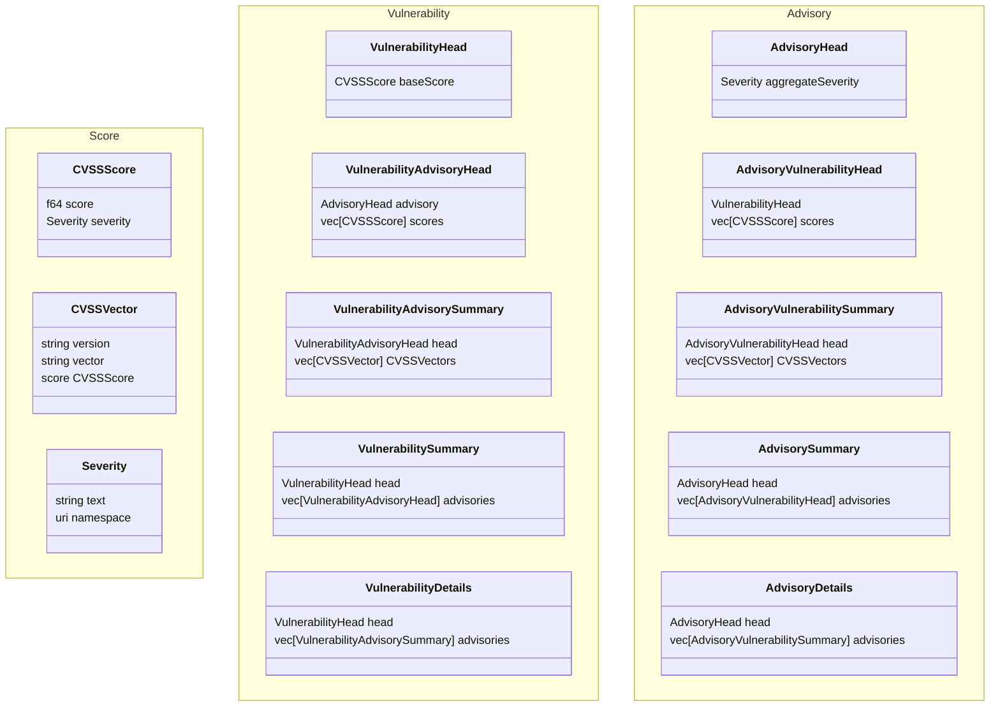

# 00004. Vulnerability scores

Date: 2025-05-06

## Status
PROPOSED

## Context

There are various vulnerability scores format versions used in different advisories. The purpose of this document is to summarize all these options and propose what Trustify need to store and return through its endpoints.

## Scores

Common Vulnerability Scoring System (CVSS) scores are used to determine severity of the vulnerabilities. The system evolved over they years, so we have multiple versions of it in use today.

The version 2 was used primarily until late 2015. Since then version 3.0 was mainly used until 2019, when it was upgraded to 3.1. Staring late 2024, CVE project started using CVSS 4.0 version of scoring.

## Advisory format

CVE JSON Schema version 5 and OSV schema that Trustify uses to ingest data from these sources support all aforementioned CVSS score formats.

OSV format supported only v2 and v3 until version 1.6.2 which was released in 2024. Most of the documents Trustify is importing today used 1.4.0 of the OSV schema.

CSAF version 2.0 (still official version), supports only v2 and v3 of CVSS standard, while the support for v4 will be introduced in 2.1 version of the CSAF standard.

## Vulnerability score

As Trustify treat the original CVE record as vulnerability, vulnerability severity and score is what's specified in the CVE file. The value is optional, but it is present in most published records. CVSS version 3 is most dominant for current files, but support for version 4 is important for going forward. Support for version 2 would be good to have for legacy data.

## Advisory scores

Advisories can "override" the original vulnerability score, depending on the further analysis or the context. Both OSV and CSAF support this. Each vulnerability described by the advisory can be attached multiple scores (but that is rare in practice).

There's no rush in supporting CVSS v4 for these standards as they are still not widely used. Again, CVSS v2 would be good to have.

## Aggregate severity

OSV record describes only one CVE vulnerability, while CSAF can describe multiple vulnerabilities in a single document.

That's why CSAF introduces the concept of the "aggregate severity" considering the whole document, providing the useful information on how to deal with the whole advisory. It is independent of the CVSS standard and provides just a textual representation (the usual values are "Critical", "Important", "Moderate").

For OSV in most cases there is only single score for a single vulnerability, so in that case the severity is just copied from the score. In case there are multiple scores the aggregate can be calculated. There are no fixed way to do this, but getting the highest severity is considered a good practice.

## Endpoints

This is the simplified model of the API components representing scores and severities

In summary, the "head" objects contain only base and aggregated values for vulnerability and advisory. The "summary" object
contain list of advisories/vulnerabilities with the list of their scores, while "details" objects contain additionally a list
of the whole CVSS vector data. The CVSS vector can be returned as an additional component, to help UI/clients avoid the parsing.