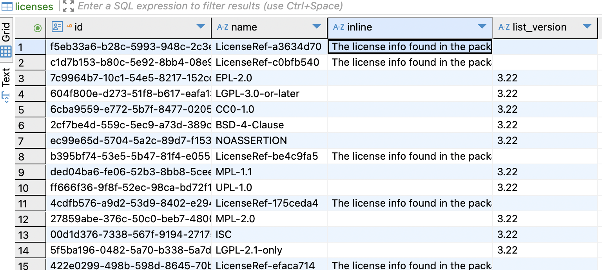

# 00005. Analysis of the license data structure.

Date: 2025-01-23

## Status

DRAFT

## Context
### An SBOM typically contains three types of license information:

#### 1 License information for the entire SBOM


##### 1.1 CycloneDX SBOM-level License

```json
"licenses" : [
  { 
    "license" : { 
      "id" : "Apache-2.0" 
    }
  }
]
```

##### 1.2 SPDX SBOM-level License
```json
"dataLicense": "CC0-1.0",
```
If I understand correctly, CycloneDX's SBOM-level License refers to the license of the package corresponding to the SBOM, while SPDX's SBOM-level License refers to the license of the SBOM document itself.
#### 2 Package-level licenses
##### 2.1 CycloneDX
Contains three types: Id, name, and Expression
The Expression follows the SPDX expression standard.
```json
"licenses" : [  {    "license" : {      "id" : "EPL-1.0"    }  },  {    "license" : {      "name" : "GNU Lesser General Public License",      "url" : "http://www.gnu.org/licenses/old-licenses/lgpl-2.1.html"    }  }],`

```
##### 2.2 SPDX
It's Expression and follows the SPDX expression standard.
```json
"licenseDeclared": "Apache-2.0 OR LicenseRef-GPL-2.0-with-classpath-exception",
```
##### 2.3 Special Types in SPDX: ExtractedLicensingInfos
```json
"hasExtractedLicensingInfos": [
{
"comment": "External License Info is obtained from a build system which predates the SPDX specification and is not strict in accepting valid SPDX licenses.",
"extractedText": "The license info found in the package meta data is: GPL-2.0-with-classpath-exception. See the specific package info in this SPDX document or the package itself for more details.",
"licenseId": "LicenseRef-GPL-2.0-with-classpath-exception",
"name": "GPL-2.0-with-classpath-exception"
},
```
The licenseId can be associated with the license in the package.
### 2 Current license export requirements
https://docs.google.com/spreadsheets/d/1Ki9hkLl94L3G4A4rfQQ4wuEnQFTPkpNflClVjlk2mQA/edit?gid=0#gid=0

### 3 Current license data structure design in trustify

```rust
pub struct Model {
    #[sea_orm(primary_key)]
    pub id: Uuid,
    pub text: String,
    pub spdx_licenses: Option&lt;Vec&lt;String&gt;&gt;,
    pub spdx_license_exceptions: Option&lt;Vec&lt;String&gt;&gt;,
}
```
The text field corresponds to CycloneDX's Id, Name, or complete Expression. When it's an Expression, it will be parsed into a license array and stored in spdx_licenses, while parsing exceptions are stored in spdx_license_exceptions.
For SPDX, the text field corresponds to the complete Expression. Similarly, the Expression will be parsed into a license array and stored in spdx_licenses, with parsing exceptions stored in spdx_license_exceptions.
Currently missing SPDX's ExtractedLicensingInfos and SBOM-level licenses.

### 4 License data structure in GUAC

GUAC parses all expressions into individual licenses and saves them separately. LicenseRef* represents ExtractedLicensingInfos, with its extractedText stored in the inline field.

## Decision

### Current design proposal

```rust
pub enum LicenseCategory {
    #[sea_orm(string_value = "slc")]
    SPDXDECLARED,
    #[sea_orm(string_value = "sld")]
    SPDXCONCLUDED,
    #[sea_orm(string_value = "clci")]
    CYDXLCID,
    #[sea_orm(string_value = "clcn")]
    CYDXLCNAME,
    #[sea_orm(string_value = "cle")]
    CYDXLEXPRESSION,
    #[sea_orm(string_value = "cd")]
    CLEARLYDEFINED,
    #[sea_orm(string_value = "o")]
    OTHER,
}
```
SPDXDECLARED: The license from spdx sbom's declered license.
SPDXCONCLUDED: The license from spdx sbom's concluded license.
CYDXLCID: The license from CycloneDX sbom's id.
CYDXLCNAME: The license from CycloneDX sbom's name.
CYDXLEXPRESSION: The license from CycloneDX sbom's Expression.

Where license_id is the same as name in GUAC, license_ref_id serves as a foreign key linking to the Id of extracted_licensing_infos. I illustrate this design through two unit tests https://github.com/trustification/trustify/pull/1164/files#diff-e2251167d81406b13fac64820ca3c5af49095705376eb2d6a21830270605d69cR99.
This design currently has two issues:
1. The complete expression is not saved, as the complete expression includes not only individual license
   information but also the relationships between these licenses.
2. SBOM-level licenses are not saved.

## Alternative approaches

## Consequences