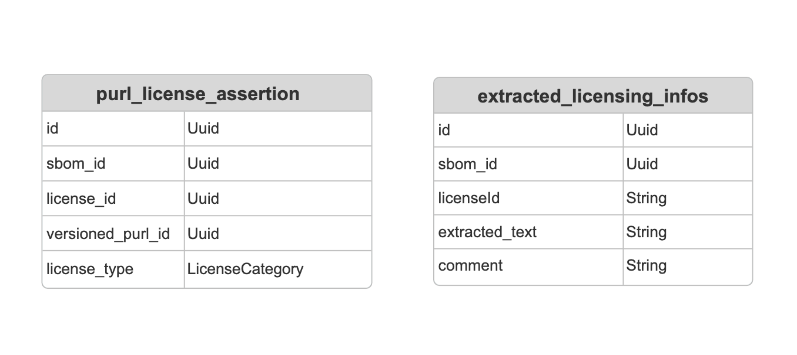

# 00005. Analysis of the license data structure.

Date: 2025-01-23

## Status

DRAFT

## Context
1. [The analysis of the license information in the SBOM](#the-analysis-of-the-license-information-in-the-sbom)
    1. [License information for the entire SBOM](#license-information-for-the-entire-sbom)
       1. [CycloneDX SBOM-level License](#cyclonedx-sbom-level-license)
       2. [SPDX SBOM-level License](#spdx-sbom-level-license)
    2. [Package-level licenses](#package-level-licenses)
       1. [CycloneDX](#cyclonedx)
       2. [SPDX](#spdx)
    3. [Special Types in SPDX: ExtractedLicensingInfos](#special-types-in-spdx-extractedlicensinginfos)
2. [Current license export requirements](#current-license-export-requirements)
   1. [Requirement Description](#requirement-description)
   2. [Detail Info](#detail-info)
3. [Current license data structure design in trustify](#current-license-data-structure-design-in-trustify)
4. [Decision](#decision)
   1. [Current design proposal](#current-design-proposal)
      1. [Data model](#data-model)
      2. [SBOM ingestion](#sbom-ingestion)
      3. [License Extract API](#license-extract-api)
      4. [UI](#ui)
5. [Alternative approaches](#alternative-approaches)
   1. [Advantages of this alternative approach](#advantages-of-this-alternative-approach)
   2. [Disadvantages of this alternative approach](#disadvantages-of-this-alternative-approach)


## The analysis of the license information in the SBOM
### License information for the entire SBOM


#### CycloneDX SBOM-level License

```json
"licenses" : [
  { 
    "license" : { 
      "id" : "Apache-2.0" 
    }
  }
]
```

#### SPDX SBOM-level License
```json
"dataLicense": "CC0-1.0",
```
If I understand correctly, CycloneDX's SBOM-level License refers to the license of the package corresponding to the SBOM, while SPDX's SBOM-level License refers to the license of the SBOM document itself.
### Package-level licenses
#### CycloneDX
Contains three types: Id, name, and Expression
The Expression follows the SPDX expression standard.
```json
"licenses" : [
  {
      "license" : {
      "id" : "EPL-1.0"
    }
  },
  {
    "license" : {
      "name" : "GNU Lesser General Public License",
      "url" : "http://www.gnu.org/licenses/old-licenses/lgpl-2.1.html"
    }
  }
],
```
#### SPDX
It's Expression and follows the SPDX expression standard.
```json
"licenseDeclared": "Apache-2.0 OR LicenseRef-GPL-2.0-with-classpath-exception",
```
#### Special Types in SPDX: ExtractedLicensingInfos
```json
"hasExtractedLicensingInfos": [
{
  "comment": "External License Info is obtained from a build system which predates the SPDX specification and is not strict in accepting valid SPDX licenses.",
  "extractedText": "The license info found in the package meta data is: GPL-2.0-with-classpath-exception. See the specific package info in this SPDX document or the package itself for more details.",
  "licenseId": "LicenseRef-GPL-2.0-with-classpath-exception",
  "name": "GPL-2.0-with-classpath-exception"
},
```
The licenseId can be associated with the license in the package.
### Current license export requirements
#### Requirement Description
The application must allow users to download all license data associated with a specific SBOM. This functionality will be accessible from both the **SBOM list** and the **SBOM detail page**.

Due to the way license data is structured in **SPDX SBOMs** (as detailed below), two export files need to be generated:

1. **Primary License Export File**
    - Each row corresponds to a unique component-license combination.

2. **ExtractedLicensingInfos Export File**
    - This file is only included if the original SBOM follows the SPDX format.

Since these two files are always generated together, users will download a **compressed archive (tar.gz)** containing both CSV files.

#### Detail Info

Below, I will list all the required fields for the license export along with their descriptions.

###### SBOM package licenses
| Field Name        | column name                 | Description                                                                                                               | SPDX                                                                                                     | CycloneDX   | 
|-------------------|-----------------------------|---------------------------------------------------------------------------------------------------------------------------|----------------------------------------------------------------------------------------------------------|-------------|
| sbom_name         | name                        | sbom_name: it's the name of the SBOM.                                                                                     | yes                                                                                                      | yes         |
| sbom_namespace    | namespace                   | It comes from the SPDX's documentNamespace node.                                                                          | yes                                                                                                      | Unsupported |
| component_group   | group                       | The component's group.                                                                                                    | Unsupported                                                                                              | yes         |
| component_version | version                     | The component's version.                                                                                                  | Unsupported                                                                                              | yes         |
| package_name      |                             | This SBOM contains multiple packages or components, and package_name refers to the names of these packages or components. | yes                                                                                                      | yes         |
| purl              | package reference           | [1](#detailed-description-of-the-package-in-spdx) [2](#detailed-description-of-the-component-in-cyclonedx)                | yes         | yes         |
| cpe               | alternate package reference | [1](#detailed-description-of-the-package-in-spdx) [2](#detailed-description-of-the-component-in-cyclonedx)                | yes                                                                                                      | yes         |
| text              | license expression          | License content, it's text content, for SPDX it just from licenseDeclared                                                 | yes                                                                                                      | yes         |
| spdx_licenses     | license                     | license ids, it's parsed by License content.                                                                              | yes                                                                                                      | yes         |
| Unsupported              | license name                | This name is the value taken when the type of license in CycloneDX is "name." .                                                                                                             | yes                                                                                                      | yes         |

###### Licenses Mapping
| Field Name      | column name | Description                   | SPDX                                                                                                     | CycloneDX   | 
|-----------------|-------------|-------------------------------|----------------------------------------------------------------------------------------------------------|-------------|
| licenseId       |     licenseId        | The licenseId from [here](#special-types-in-spdx-extractedlicensinginfos).     | yes                                                                                                      | Unsupported         |
| name            |        name     | The name from [here](#special-types-in-spdx-extractedlicensinginfos).          | yes                                                                                                      | Unsupported         |
| extracted text |       extracted text      | The extractedText from [here](#special-types-in-spdx-extractedlicensinginfos). | yes                                                                                                      | Unsupported         |
| comment       |     comment        | The comment from [here](#special-types-in-spdx-extractedlicensinginfos). | yes                                                                                                      | Unsupported         |


**When it is an SPDX SBOM, the required fields are these.**
sbom_name: it's a name of sbpm.
```json
  "name": "openssl-3.0.7-18.el9_2",
```
sbom_namespace:
```json
"documentNamespace": "https://www.redhat.com/openssl-3.0.7-18.el9_2.spdx.json",
```
##### Detailed description of the package in SPDX.
package_name and purl and cpe from package of packages node
```json
{
      "name": "cloud.google.com/go/compute",
      "SPDXID": "SPDXRef-Package-go-module-cloud.google.com-go-compute-36357a787dfd18c0",
      "versionInfo": "v1.6.1",
      "downloadLocation": "NOASSERTION",
      "checksums": [
        {
          "algorithm": "SHA256",
          "checksumValue": "dac326b7ca6b0a7ec33da1b83e687437722799cf1c4fc69ee64d4ce9527d5aa7"
        }
      ],
      "sourceInfo": "acquired package info from go module information: /coredns",
      "licenseConcluded": "NONE",
      "licenseDeclared": "NONE",
      "copyrightText": "NOASSERTION",
      "externalRefs": [
        {
          "referenceCategory": "SECURITY",
          "referenceType": "cpe23Type",
          "referenceLocator": "cpe:2.3:a:go:compute:v1.6.1:*:*:*:*:*:*:*",
          "comment": ""
        },
        {
          "referenceCategory": "PACKAGE-MANAGER",
          "referenceType": "purl",
          "referenceLocator": "pkg:golang/cloud.google.com/go/compute@v1.6.1",
          "comment": ""
        }
      ]
    },
```
Purl comes from externalRefs and the referenceCategory is equal to PACKAGE-MANAGER., Cpe comes from externalRefs and the referenceCategory is equal to SECURITY. Field text is licenseDeclared, do not need licenseConcluded, spdx_licenses from parsed SPDX expression(licenseDeclared).

**When it is an CycloneDX SBOM, the required fields are these.**
sbom_name,component_group,component_version it from node.
```json
"component" : {
      "group" : "org.springframework.samples",
      "name" : "spring-petclinic",
      "version" : "3.3.0-SNAPSHOT",
      "description" : "Parent pom providing dependency and plugin management for applications built with Maven",
      "licenses" : [
        {
          "license" : {
            "id" : "Apache-2.0"
          }
        }
      ],
      "purl" : "pkg:maven/org.springframework.samples/spring-petclinic@3.3.0-SNAPSHOT?type=jar",
      "externalReferences" : [
        {
          "type" : "website",
          "url" : "https://spring.io/projects/spring-boot/spring-petclinic"
        },
        {
          "type" : "vcs",
          "url" : "https://github.com/spring-projects/spring-boot/spring-petclinic"
        }
      ],
      "type" : "application",
      "bom-ref" : "pkg:maven/org.springframework.samples/spring-petclinic@3.3.0-SNAPSHOT?type=jar"
    },
```
##### Detailed description of the component in CycloneDX.
package_name and purl and cpe from component of components node
```json
{
   "bom-ref": "pkg:npm/%40gradio/accordion@0.3.4?package-id=fe04107cd3981052",
   "type": "library",
   "name": "@gradio/accordion",
   "version": "0.3.4",
   "description": "Gradio UI packages",
   "licenses": [
      {
         "license": {
            "id": "ISC"
         }
      }
   ],
   "cpe": "cpe:2.3:a:\\@gradio\\/accordion:\\@gradio\\/accordion:0.3.4:*:*:*:*:*:*:*",
   "purl": "pkg:npm/%40gradio/accordion@0.3.4",
   "properties": [
      ...
   ]
},
```
Field text is the entire license expression from licenses node. like:
```json
"licenseDeclared": "Apache-2.0 AND MIT",
```
spdx_licenses from parsed by the license expression. Like:
```json
[Apache-2.0, MIT]
```

### Current license data structure design in trustify
**I use an example to demonstrate where the existing data structure does not meet the requirements.**
```rust
#[derive(Debug, FromQueryResult)]
pub struct SbomLicenseBase {
   pub sbom_name: Option<String>,
   pub sbom_namespace: Option<String>,
   pub component_group: Option<String>,
   pub component_version: Option<String>,
   pub node_id: String,
   pub sbom_id: Uuid,
   pub package_name: String,
   pub version: String,
   pub purl: serde_json::Value,
   pub cpe:  Option<Vec<String>>,
   pub text: Option<String>,
   pub spdx_licenses: Option<Vec<String>>,
   pub spdx_license_exceptions: Option<Vec<String>>,
}

#[test_context(TrustifyContext)]
#[test(tokio::test)]
async fn test_spdx(ctx: &TrustifyContext) -> Result<(), anyhow::Error> {
   let _result = ctx
           .ingest_document("quarkus-bom-2.13.8.Final-redhat-00004.json")
           .await?;
   let sbom_license_base: Vec<SbomLicenseBase> = sbom::Entity::find()
           .join(JoinType::LeftJoin, sbom::Relation::Packages.def())
           .join(JoinType::Join, sbom_package::Relation::Node.def())
           .join(JoinType::LeftJoin, sbom_package::Relation::Purl.def())
           .join(JoinType::Join, sbom_package_purl_ref::Relation::Purl.def())
           .join(
              JoinType::LeftJoin,
              qualified_purl::Relation::VersionedPurl.def(),
           )
           .join(
              JoinType::LeftJoin,
              versioned_purl::Relation::LicenseAssertions.def(),
           )
           .join(
              JoinType::LeftJoin,
              purl_license_assertion::Relation::License.def(),
           )
           .select_only()
           .column_as(sbom::Column::SbomId, "sbom_id")
           .column_as(sbom_package::Column::NodeId, "node_id")
           .column_as(sbom_package::Column::Version, "version")
           .column_as(sbom_node::Column::Name, "package_name")
           .column_as(qualified_purl::Column::Purl, "purl")
           .column_as(license::Column::Text, "text")
           .column_as(license::Column::SpdxLicenses, "spdx_licenses")
           .column_as(
              license::Column::SpdxLicenseExceptions,
              "spdx_license_exceptions",
           )
           .into_model::<SbomLicenseBase>()
           .all(&ctx.db)
           .await?;
  
   Ok(())
}
```
As shown in the above example, we are currently storing both licenseDeclared and licenseConcluded, and we are unable to distinguish between them.
At same time, if the SBOM is cycloneDX, component_group will miss.The information in the ExtractedLicensingInfos section is completely missing.

## Decision

### Current design proposal
#### Data model
The current design requires adding a license_type field in purl_license_assertion, as well as a new entity called extracted_licensing_infos. Additionally, Sbom_node Entity add new field group.

```rust
pub enum LicenseCategory {
    #[sea_orm(string_value = "slc")]
    SpdxDeclared,
    #[sea_orm(string_value = "sld")]
    SpdxConcluded,
    #[sea_orm(string_value = "clci")]
    CydxLcid,
    #[sea_orm(string_value = "clcn")]
    CydxLcname,
    #[sea_orm(string_value = "cle")]
    CydxLexpression,
    #[sea_orm(string_value = "cd")]
    ClearlyDefined,
    #[sea_orm(string_value = "o")]
    Other,
}
```

Currently, the system's licenses come from the following sources: 1) SPDX's declared license and concluded license, 2) CycloneDX, and 3) clearlyDefined. The license export only requires SPDX's declared license and CycloneDX licenses, while concluded licenses and clearlyDefined licenses are not needed. Therefore, the system must distinguish between them.

SpdxDeclared: The license from spdx sbom's declered license.
SpdxConcluded: The license from spdx sbom's concluded license.
CydxLcid: The license from CycloneDX sbom's id.
CydxLcname: The license from CycloneDX sbom's name.
CydxLexpression: The license from CycloneDX sbom's Expression.

#### SBOM ingestion
Add the following actions during the ingestion process.
1. add component_group into Entity sbom_node.
2. add LicenseCategory into Entity purl_license_assertion.
3. create new Entity extracted_licensing_infos.

#### License Extract API
This section of the code can be divided into three parts.
1. Data Collection
   - This section of the code can refer to [here](#current-license-data-structure-design-in-trustify)    

 2. Generate the CSV file and compress it. 
    - This code can refer version one's code.
 3. Endpoint
    - HTTP GET **/api/v2/sbom/{id}/license** Id: sbom id
    
#### UI
License export action on the SBOM List and SBOM Detail screens.

## Alternative approaches
Currently, there is an alternative method. Instead of retrieving relevant information through the database's Entity, it directly obtains the original SBOM file, parses it, and extracts all the information to generate the corresponding CSV files.
1. SBOM ingestion
   - Do not needs change.
2. License Extract API.
    1. Data Collection
       - Same to version one.
    2. Generate the CSV file and compress it.
       - This code can refer version one's code.
    3. Endpoint
    - HTTP GET **/api/v2/sbom/{id}/license** Id: sbom id
3. UI
   - License export action on the SBOM List and SBOM Detail screens.
### Advantages of this alternative approach
- **Simplicity**: Directly processes the SBOM file without any change of currents data model and SBOM ingestion, making the workflow simpler and easier to implement.
- **Faster Development**: This approach can speed up the development process since it reduces the need for creating complex database models and handling potential synchronization issues.

### Disadvantages of this alternative approach
- **Data Inconsistency**: Since data is analyzed directly from the SBOM file, it might not match the existing database data. This can result in having the same data coming from two different sources, leading to potential discrepancies.
- **Function Redundancy**: The function of parsing SBOM files could be duplicated, as both the database and this alternative approach would handle the same task of parsing SBOM files, leading to unnecessary repetition of functionality.

## Consequences