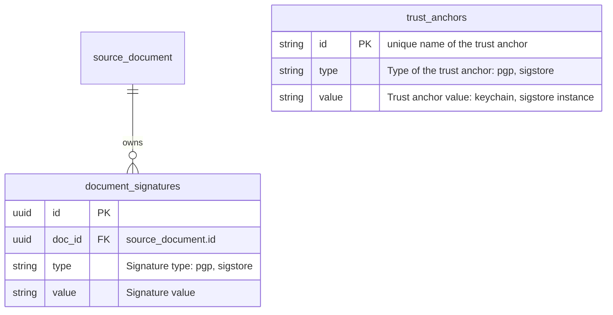

# 00005. Handling of signatures

Date: 2025-04-22

## Status

DRAFT

## Context

Currently, when importing SBOMs and CSAF documents via the importers, we do check the GPG signatures provided and fail
the document (not the whole process) in cases where the signature is invalid.

This leads to documents not being imported if the signature is not valid.

That process has a bunch of drawbacks:

* It's only supported via the importer process
* There's no (except from the importer report) information visible to the user
* There's only one source for signatures, the one of the importer source
* We do not store the signatures

Today signatures are seen as an element of the importer (transport) process. The automatic import process ensures, using
the provided/published signatures, that the document was not tampered with during the transport.

The goal of this ADR is to:

* [ ] Add the ability to store one or more signatures for each imported document
* [ ] Add an importer of signatures from one or more Sigstore sources
* [ ] Allow the user to inspect the document's signature and give a visual indication "if the signature is good"
* [ ] Define a way to deal with invalid signatures

## Proposal

We create a new table, alongside the `source_document` table, storing all known signatures for a document. With that,
we can, later on, extract all kinds of information from this.

GPG signatures of documents will be stored in this table too. This happens during the import process.

### Sources

To validate the signatures, we need some trust anchors. Those need to be set up and linked to the documents. For
configured importers, it may be reasonable to import the keys (as trust anchors) automatically as well.

Keys are only validm when

### Database

We add a new table `document_signatures`, with the following structure:

### API

* [ ] Validate a document against a list/set/query of trust anchors (might not be necessary if done while adding a signature)
* [ ] Retrieve validation results

* `POST /api/v2/trustAnchor/{id}`: Create or overwrite a trust anchor with the ID `id`.
* `DELETE /api/v2/trustAnchor/{id}`: Delete the trust anchor with the ID `id`.

* `POST /api/v2/sbom/{sbom}/validate`: Validate an SBOM against trust anchors
  * `trustAnchor` (query, zero or more): A list of trust anchor IDs to validate against. If the list is empty, validate against all.
  * `details=<value>`: In addition to a summary, return detailed information if the value is `true`.

Alternative: Instead of doing an ad-hoc check, do a check another time, and serve the results from the database.

### UI representation

* There should be a visual representation if the document is "ok"
* There should be detail information on how that state was evaluated (signature, error information, …)
* …

## Open questions

* [ ] What will happen when the importer detects an invalid signature?
* [ ] What will happen when an invalid signature is attached to the document?
* [ ] What signatures are required for a document to be considered "ok"?
* [ ] What happens when a required signature is missing?
* [ ] Does revokation work?
* [ ] How to deal with signatures that no longer validate?
* [ ] Do we store evaluation results? When adding a signature, do we validate it, and store the result? So that we have
  the outcome stored, "at that point in time".
* [ ] In order to verify the signature, we need the original content. Which can be retrieved from the storage. But
  that's costly. Couldn't we cache the verification?
* [ ] PGP is a mechanism to ensure content is not modified during transport. For compressed content, the signature is
  in the compressed content. We store the uncompressed content. So we can't validate the signature.

## Conclusion
