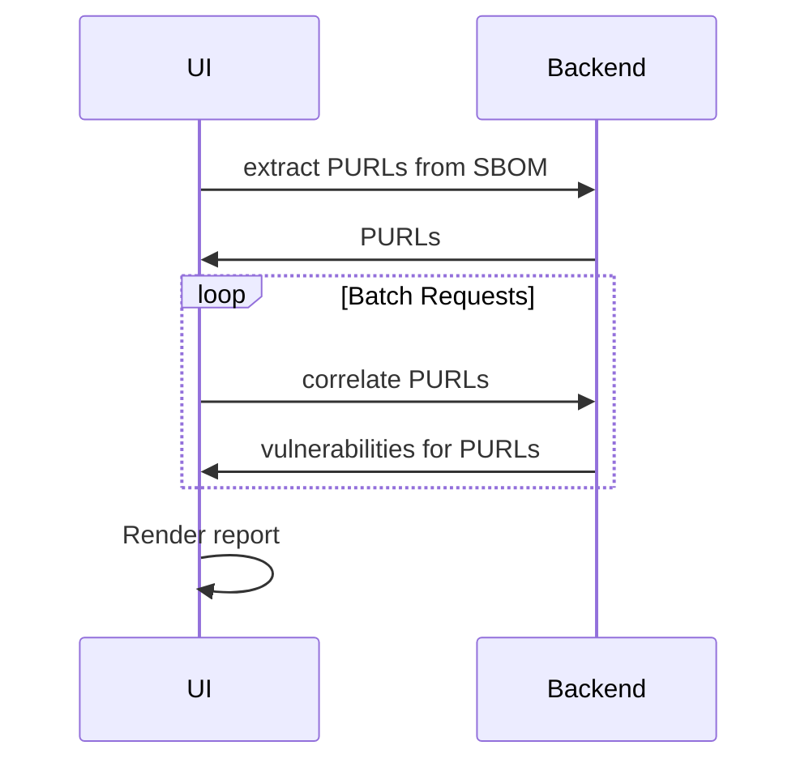
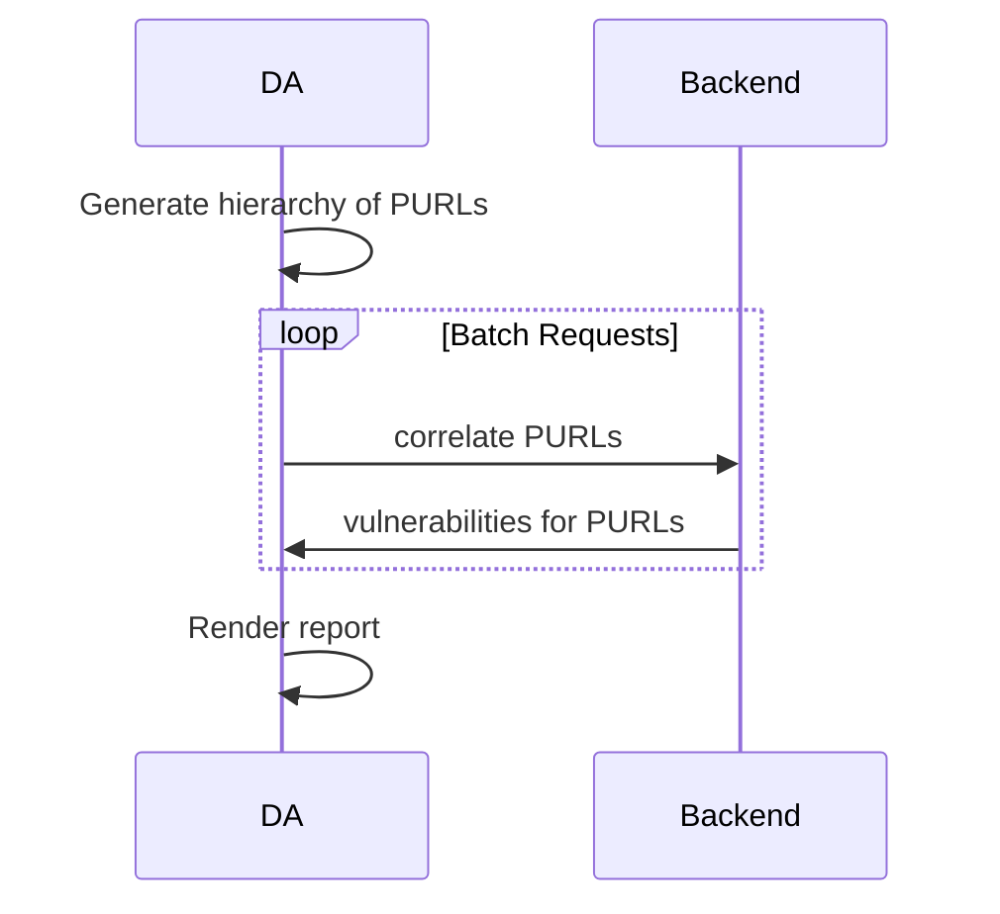
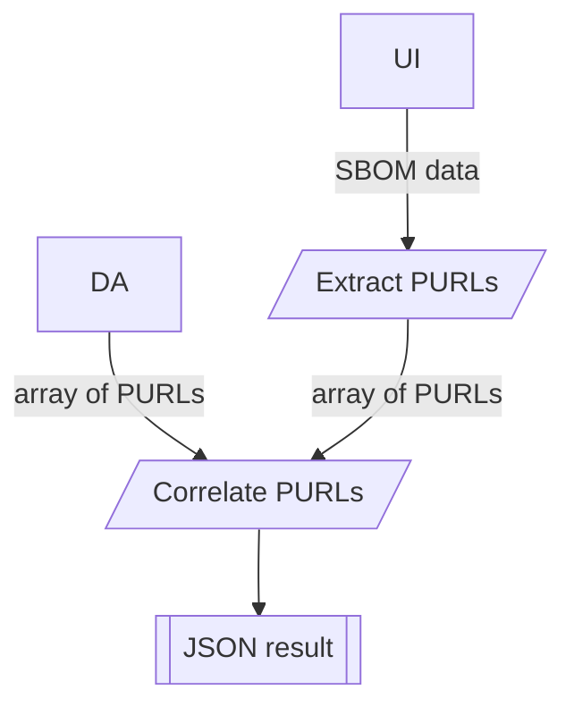

# 00007. PURL vulnerability report

Date: 2025-05-21

## Status

ACCEPTED

## Context

The UI should have a feature for users to "upload" their SBOM, and get a report about vulnerabilities of contained
components. The term "upload" may be misleading, as the backend must never store the document.

"Dependency Analytics" (DA) requires a way to check a set of PURLs for their vulnerabilities too. Ideally, we can
somehow re-use that functionality.

As processing the correlation information may require some time, we may encounter request timeouts, like we sometimes
see for larger SBOMs. We do need a way to either cut down work items into smaller pieces or ensure the connection
between the frontend and the backend stays open for long-running operations.

### Assumptions

This ADR makes the following assumptions:

* The provided SBOM will only be scanned for PURLs, not for CPEs, hashes/digests or other references

## Decision

There's a two-step process. First, upload (but don't store) the SBOM to the backend. The backend will parse the
document and extract all PURLs, returning them to the client. This process, depending on the size of the file, is
rather fast. The request shouldn't time out, as either the document or the response is being transferred. The actual
processing, without any transfer, should be quick.

The client can also list the result, once returned, to the user. To show the user what was understood from the SBOM.
But that's an optional approach.

Next, the client will send batches of PURLs to the backend, asking for vulnerability information attached to them. The
backend might take some time to come up with this information, so the client has to be careful not to use "too big"
chunks. There should be a way to tweak this for a running system (configuration).

The client uses the returned information for rendering the result.



DA can use the same API, but processes data a bit different upfront:



The flow of data is like this:



## API

* `POST /api/v2/ui/extractSbomPurls`: Send an SBOM, retrieve all PURLs

  Response (`200 OK`):

  ```json5
  {
    "purls": [
      "pkg:maven/org.apache.xmlgraphics/batik-anim@1.9.1?packaging=sources",
      "pkg:npm/%40angular/animation@12.3.1"
    ],
    "relationships": [
      {
        "from": 0, // index 0 in `purls` array
        "to": 1, // index 1 in `purls` array,
        "relationship": "dependsOn" // enum from trustify
      }
    ]
  }
  ```
  
* `POST /v2/vulnerability/analyze`: Analyze PURLs (already exists)

  Request:

  ```json5
  {
    "purls": [
      "pkg:maven/org.apache.xmlgraphics/batik-anim@1.9.1?packaging=sources",
      "pkg:npm/%40angular/animation@12.3.1"
    ]
  }
  ```

  Response: (`200 OK`)

  ```json5
  {
    "pkg:npm/%40angular/animation@12.3.1": [
      {} // vulnerability information
    ],
    "pkg:maven/org.apache.xmlgraphics/batik-anim@1.9.1?packaging=sources": [
      {},  // vulnerability information
      {}   // vulnerability information
    ]
  }
  ```

## Open items

* [x] Find a better path/name for the "extract PURLs" endpoint: Using `/ui/` now, as its mainly targeted at the UI and
  doesn't conflict with `/sbom/` namespace.
* [ ] Do we need the PURL hierarchy extracted as well?
* [x] The DA functionality seems to perform some steps as well (extract PURLs, generate complete JSON "report", 
  render HTML report). Could we come up with a solution, adding this to the backend as well? Re-using that exact same
  logic: We use the same API for correlation, but not more, as the DA backend does a few things in addition.

## Alternative approaches

Have the browser extract the PURLs and send those to the backend for checking.

* 👍 The data transmitted to the backend would be way less. This would also need less CPU and memory on the backend.
  We would not need a new endpoint.
* 👍 The full data would never end up on the backend, so we'd never get in contact with information we don't need
* It's unclear (without measuring) what's faster from a user perspective. Processing the file locally requires resources
  and takes some time. But transmitting a larger document does too.
* 👎 There's a notion of consolidating logic on the backend.

~~Have the browser use a websocket API instead of the DA HTTP API:~~

* 👎 Adds "websockets" as a technology
* 👎 Duplicate functionality of the dependency analytics API
* 👍 Frees the browser from scheduling/batching requests


## Consequences

* We add a simple, stateless endpoint for extracting PURLs from SBOMs.
* The UI will also use the DA endpoint for correlating PURLs with vulnerabilities.
