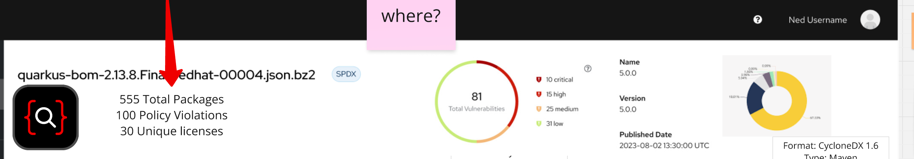
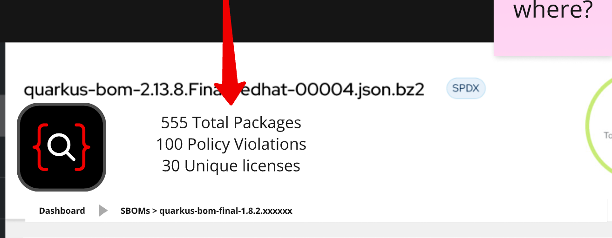
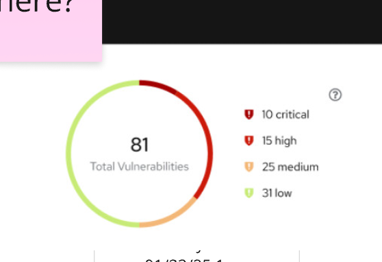

# 00007. Sbom dashboard.

Date: 2025-04-27

## Status

DRAFT

## Context
This ADR document is intended to define and implement the backend logic for the heard of SBOM dashboard in the UI.

Its mockup design document is as follows.

### This dashboard's header can be divided into three parts:
- sbom state

  The information includes two components: the total sum of the Packages and the total sum of individual licenses (with Policy Violations removed). 
- Vulnerabilities state

  It also contains the total number of Vulnerabilities, as well as the count for each severity level.
- License info

  It consists of two parts:
    - SBOM information (name, version, published date).
    - License grouping - aggregating all unique licenses and visualizing them in a pie chart.

## Decision
### Why is it divided into three endpoints?
Because these three features each require substantial computation, combining them into a single endpoint would result in excessively long page response times and negatively impact the user experience.

### Design an endpoint for each of these parts.
- sbom state
  -  **HTTP GET api/v2/sbom/{id}/sbom-status**
  -  Reponse playload
  ```json
  {
    "total_packages": "0",
    "total_licenses": "0"
  }
  ```
  - **total_packages** indicates the number of packages contained in the SBOM, which can be obtained from the sbom_package model.
  - **total_licenses** indicates the number of distinct license IDs contained in the SBOM, including only standard SPDX IDs. This value can be obtained by counting the spdx_licenses field in the license model. 
- Vulnerabilities state
  -  **HTTP  GET api/v2/sbom/{id}/vulnerabilities-status**
  - -  Reponse playload
  ```json
  {
    "total_vulnerabilities": "0",
    "total_none": "0",
    "total_critical": "0",
    "total_high": "0",
    "total_medium": "0",
    "total_low": "0"
  }
  ```
 - **total_vulnerabilities** represents the total number of vulnerabilities across all packages in the SBOM. You can calculate this by retrieving each package’s purl, fetching its PurlAdvisory via PurlDetails, then obtaining the PurlStatus from that advisory, and finally counting all vulnerabilities and grouping them by severity level.


- license state
  -  **HTTP GET api/v2/sbom/{id}/license-status*
  -  Reponse playload
  ```json
  {
    "name": "Sbom-name",
    "version": "0",
    "published_date": "",
    "licenses": [
      { "name:": "Apache-2.0", "count": "10"},
      { "name:": "MIT", "count": "10"},
      ...
    ]
  }
  ```
  - **licenses** represents all license IDs appearing in this SBOM (custom licenses are collectively labeled as “other”), and counts their occurrences.