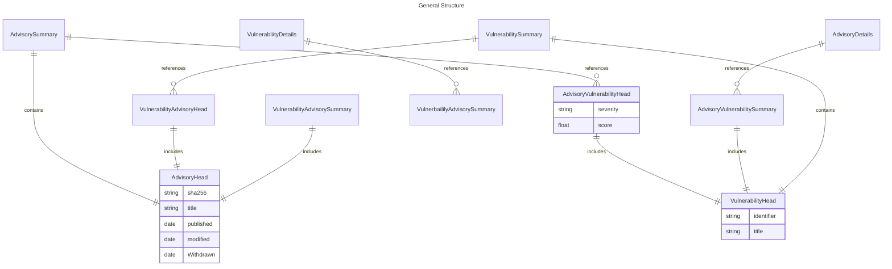

# Fetch Service

## Purpose
The fetch service is used to fetch, without much analysis or calcuation, a variety of entities for the REST API.
Some traversal does occur, as top-level entities may include relevant joined entities.

## Types of DTOs

There are currently 3 varieties of DTOs in play. 
To demonstrate, we will use the intersection of *Advisory* and the *Vulnerabilities* it may reference.

The various types will be described below, but generally-speaking:

* Summary DTOs contains the head of the object.
  * Summary DTOs may link to heads of _related_ objects.
* Detail DTOs contains the object of the object.
  *  Detail DTOs may link to summaries of _related_ objects.

### Head

### Advisory

The "head" of an Advisory contains very top-level aspects of the Entity, such as:

* Identifer
* Hashes/digests to address it
* Dates relevant to the publication, modification and withdrawal.
* It's title

#### AdvisoryVulnerability

Sitting between Advisory and Vulnerability (in that particular direction) is another DTO referred to as an "advisory-vulnerability join", which also can have a "head" and "summary" variant.

The head of this join includes:

* Severity
* Score

The summary of this join includes:

* The vulnerability's "head"
* Verbatim CVSS3 scores
* Fixed/NotAffected/Affected assertions
 
### Vulnerability
 
The "head" of a Vulnerability contains very top-level aspects also, such as

* Identifer
* Title

Neither of these head DTOs are directly fetchable from the REST API.

#### VulnerabilityAdvisory

Sitting between Vulnerabilitly and Advisory (in that particular direction) is another DTO referred to as a "vulnerability-advisory join", which also can have a "head" and "summary" variant.

The head of this join includes:

* The advisory's "head"
* Verbatim CVSS3 scores
* Fixed/NotAffected/Affected assertions

### Summary

When performing a collection search, either from the root ("all advisories") or as a sub-tree under another entity ("all advisories related to a given vulnerability"), it is the *summary* objects that are returned.

The summary of a vulnerability includes the "head" as described above, plus a list of "heads" for associated vulnerability-advisories joins.

The summary of an advisory includes the "head" as described above, plus a list of associated advisory-vulnerability joins.

### Details

Details objects contain _all_ required information, and may link to _summaries_ of related objects (which may then link to _heads_ of their second-order related objects).

