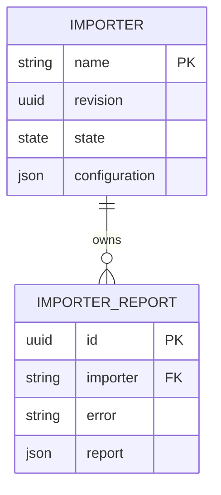
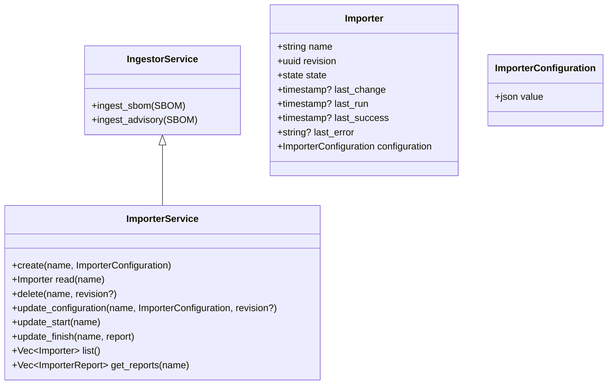
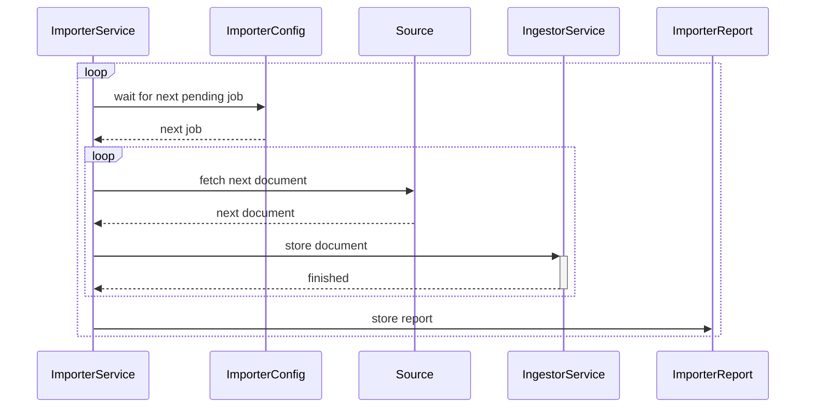

# Importer

The importer is responsible for importing documents into the system.

Module level documentation: [modules/importer/README.md](../../modules/importer/README.md)

## Entities

## Services

