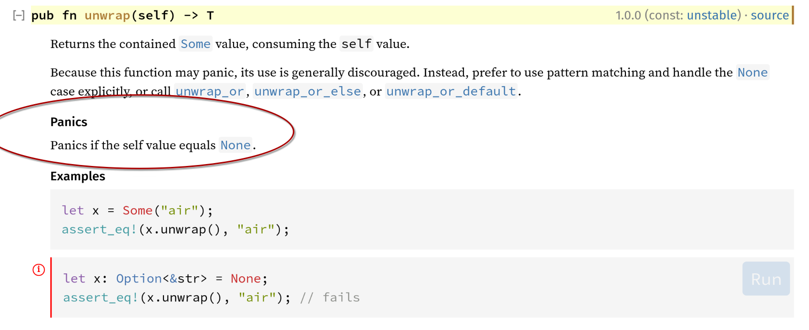
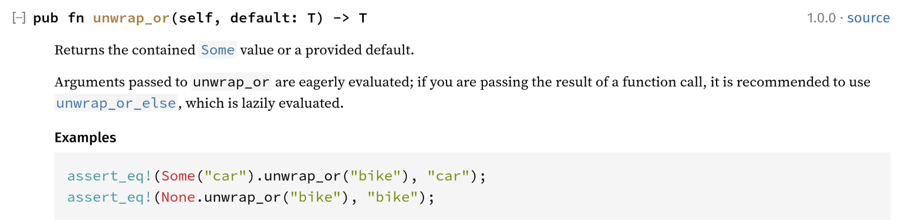

# Logging and Tracing

A few ideas around logging and tracing.

## TL;DR

A quick summary:

* Don't panic, don't println (see below for exceptions).
* [Log messages](https://crates.io/crates/log) and [tracing](https://crates.io/crates/tracing) should be relevant to
  operating personell and developers, not end users. Ops will either run
  with a level of `warn` or `info` when sending to a tracing solution (like Jaeger).
* Errors and warnings, which are relevant to the end user, must be sent back using the same channel (API call, UI, …)
  not the logging system
* Be reasonable with the amount of data being logged (might be transmitted to a tracing system, like Jaeger)
* Instrumentation (`#[instrument]` and friends)
  * Only apply to time-consuming or complex functions
  * Skip large fields: `#[instrument(skip(self, large_arg))]`
  * Add return values (as info) if relevant: `#[instrument(ret)]`
  * For larger return values, skip the "ok value" using `err` with a custom level: `#[instrument(err(level=tracing::Level::INFO))]`

## Rationale

Logging and tracing is intended for either developers or operators (humans) of the system. Not for end users.

This means that errors or warnings relevant to the end user should be propagated through the API and UI to the user,
not the console or logging/tracing systems like opentelemetry.

## Levels

* `error` – Something went seriously wrong, the application can no longer work properly and will most likely exit next.
* `warning` – The application encountered a serious issue. However, it can continue to run and future operations are likely to succeed of the cause has been resolved.
* `info` – Something noteworthy to an operator in the case where more information is required. This might include
  important configuration settings, but must exclude secrets and credentials (which should be obfuscated).
* `debug` – Something noteworthy to a developer in the case where more information is required.
* `tracing` – Most detailed information possible.

A default setting for production workload would be `warning`. An alternate setting when operation issues are being
investigated would be `info`. In case a tracing system (like Jaeger) is being used, the information is filtered on a
different level (the tracing system), and the default setting would become `info`.

A default setting for developer workload would be `info`. Alternate settings are up to the developer.

## Instrumentation

Function calls can be wrapped with the `#[instrument]` attribute, which allows tracing calls to functions, including
their arguments and return values.

Adding instrumentation like this adds some overhead. So it should be applied with care. However, on the other side, it
can be used to profile the application, also in production environments. This can be a considerable help, when things
go wrong in production.

### Arguments

Arguments get serialized in a string format which can either be printed other sent to a tracing system. However, this
also means that the data needs to be processed. The bigger the data, the bigger the overhead. Arguments can be skipped,
and in most cases larger structs and `self` can and should be skipped:

```rust
impl Example {
  #[instrument(skip(self, data))]
  fn example(&self, data: LargeStruct, flag: bool) {
    // ...
  }
}
```

In cases where partial information of bigger structs may be relevant, it can be extracted using `field`:

```rust
impl Example {
  #[instrument(skip(items), field(num_items=items.len()))]
  fn example(items: Vec<LargeStruct>) {
    // ...
  }
}
```

### Return values and errors

The `instrument` macro allows automatically extracting return values and errors. Return values get logged with the same
level the function gets logged, and errors as `error`. This can be overridden but is a reasonable default. For `err` it
is required that the function returns a `Result`.

Contrary to the documentation, using `ret` logs both `Result::Ok` and `Result::Err` (using the same level). Adding `err`
logs the error differently (level and format). Also see: https://github.com/tokio-rs/tracing/issues/2963.

```rust
#[instrument(ret)]
fn example() -> Result<bool, Error> {}
```

As the idea is to keep `error` level messages for things that potentially disrupt the normal operation of the
application, just using `ret` is fine. Unless, of course, returning an error would actually cause a potential disruptive
situation.

This also means that the result will be logged or sent to the tracing system, so it should not be used for larger
structs. In cases like that, use `err`, but lower the level to `info`:

```rust
#[instrument(err(level=tracing::Level::INFO))]
fn example() -> Result<LargeStruct, Error> {}
```

## println and panic

An application should not panic during normal runtime. Also, all output should use logging or tracing.

There are exceptions to this rule (aside from tests): the start of the application. During the logging/tracing system
configuration, it might be ok to use println. And if the application cannot be started up, failing with a panic might
be ok too.

The same is true for simple command line applications, which are expected to perform a task, and then finish. Either
successful, or with an error (returned as exit code). For example, the migrations. They can run and fail, even with
a panic.

### Rationale

The main reason for all of this is: panics cannot be treated as graceful as `Result::Err`. Panics might abort the
application right away, or leave a "bad state", when being caught and handled. On the other hand, `Result::Err` does not
have any of those limitations and side effects. If it is ok for the application to just exit (with an error message),
at the moment a panic is triggered, then it is ok to use it. If you intend to handle the error, then using panic is not
the right choice.

However, those should be exceptions, not the rule.

### Watch out

**NOTE**: There are functions in Rust that might panic. Most notably the (plain) `unwrap` calls. Typically, you will
find a note in the `rustdoc` description of such functions. For example, the `Option::unwrap` function:



However, not all function variants might expose the same behavior. Just because its name starts with `unwrap` it doesn't
mean it will panic. For example, the `Option::unwrap_or` function:


