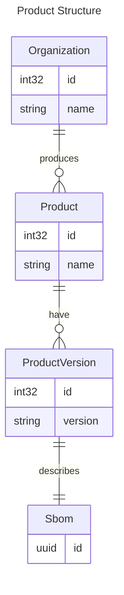

```mermaid
---
title: Product Structure
---
erDiagram

    Organization {
        int32 id
        string name
    }

    Product {
        int32 id
        string name
    }

    ProductVersion {
        int32 id
        string version
    }

    Sbom {
        uuid id
    }

    Organization || -- o{ Product : produces
    Product || -- o{ ProductVersion : have
    ProductVersion || -- || Sbom : describes

```
