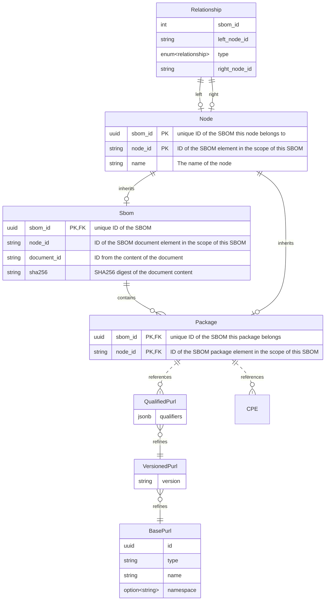

Database layout for storing SBOM information.

When storing an SBOM, we extract parts of it into the database, and also store the full document should we need it in
the future.

We do extract the following components out of the SBOM:

* Basic document metadata
* Packages
* Relationships between packages

We also detect PURLs and CPEs, and create database entries for those as well if they don't exist yet.

An SBOM contains a list of packages, which are connected by relationships (like A depends on B). For some SBOM formats
(e.g. SPDX), this may include references to the document itself (A describes SBOM), or to external documents
(SBOM-A amends SBOM-B) and packages in external documents (A depends on SBOM-B/C).

To represent this graph of SBOM, packages and relationships, the model of SPDX is being used, as it also covers the
features of CycloneDX. In the database, this is being represented by the following structure:

The `Node` table contains all possible targets for references. This can be either an SBOM or a package of an SBOM.
Creating a matching entry in the `SBOM` table, makes this node of the graph an SBOM. Adding an entry in the `Package`
table makes it a package. The relationship table links the nodes together.

The SBOM ID is an artificially generated unique ID. The node IDs are taken from the content of the SBOM and are only
considered unique in the scope of the SBOM.

The trio of `QualifiedPurl`, `VersionedPurl`, and `BasePurl` describe what used to be known as "package", but which did
not fully reflect the SBOMs model, as SBOM packages are an entity of their own, but may have zero or more PURLs or
CPEs (or other identifiers).
