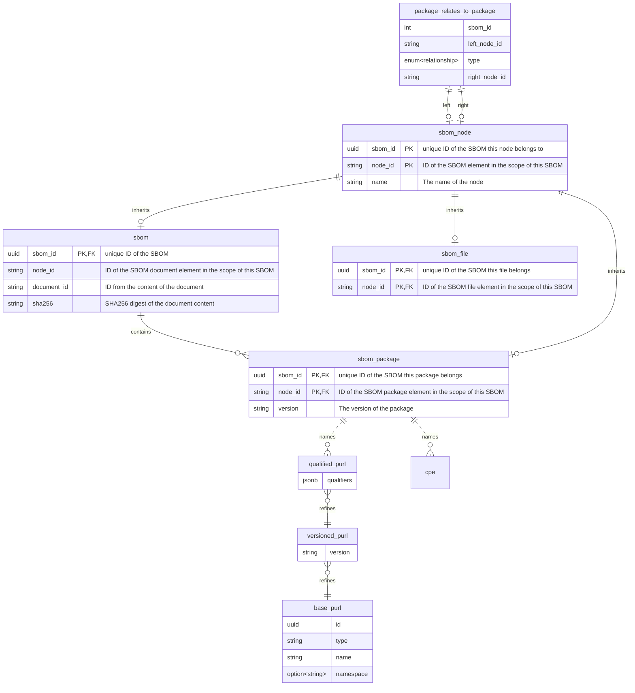

Database layout for storing SBOM information.

When storing an SBOM, we extract parts of it into the database, and also store the full document should we need it in
the future.

We do extract the following components out of the SBOM:

* Basic document metadata
* Packages
* Files
* Relationships between those nodes

We also detect PURLs and CPEs, and create database entries for those as well if they don't exist yet.

An SBOM contains a list of nodes, which are connected by relationships (like A depends on B). For some SBOM formats
(e.g. SPDX), this may include references to the document itself (A describes SBOM), or to external documents
(SBOM-A amends SBOM-B) and nodes in external documents (A depends on SBOM-B/C).

A node can be either the SBOM itself, packages (aka components), or files.

To represent this graph of SBOM, packages, files and relationships, the model of SPDX is being used, as it also covers
the features of CycloneDX. In the database, this is being represented by the following structure:

The `sbom_node` table contains all possible targets for references. This can be either an SBOM, a package of an SBOM, or
a file of the SBOM. So a node consists of the base node information in the `sbom_node` table, as well as exactly one
corresponding entry in either table of `sbom_package`, `sbom_file`, or `sbom`.

Creating a matching entry in one of those tables will make that node a type of this. e.g. adding a corresponding entry
in the `sbom_package` table makes this an SBOM package node.

The relationship table links the nodes together, creating the graph inside that SBOM.

The SBOM ID is an artificially generated unique ID. The node IDs are taken from the content of the SBOM and are only
considered unique in the scope of the SBOM. The import process will enforce the uniqueness of the Node IDs.

The trio of `QualifiedPurl`, `VersionedPurl`, and `BasePurl` describe what used to be known as "package", but which did
not fully reflect the SBOMs model, as SBOM packages are an entity of their own, but may have zero or more PURLs or
CPEs (or other identifiers).
