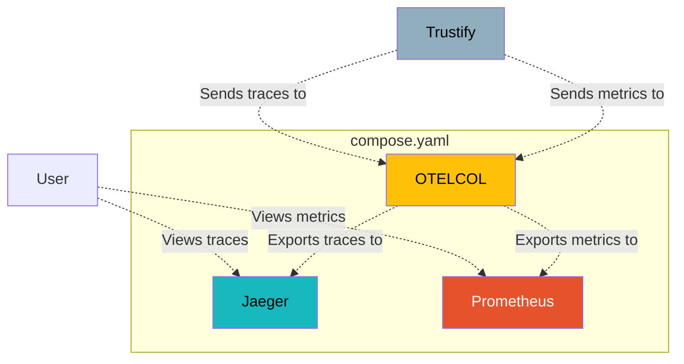
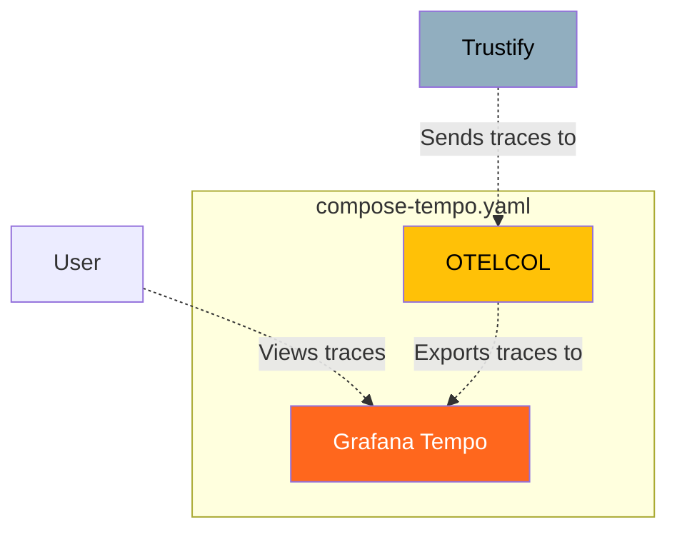
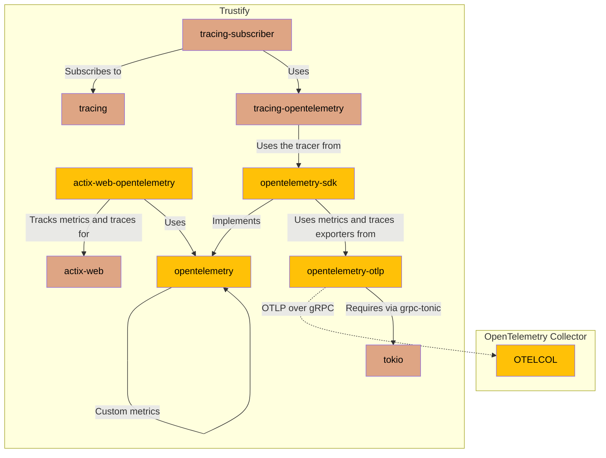
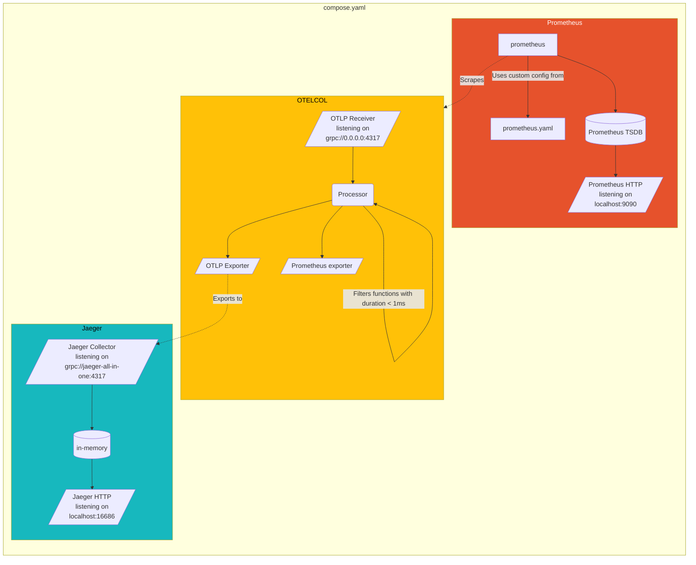
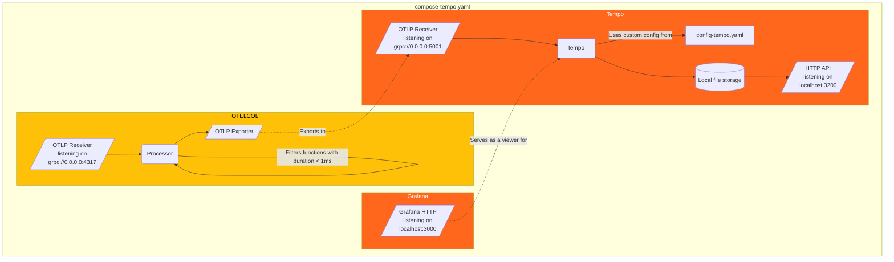
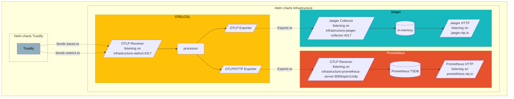

# OpenTelemetry

[OpenTelemetry](https://opentelemetry.io/) (OTEL) is an observability framework for collecting, generating,
and exporting telemetry data (traces, metrics, and logs, aka [signals](https://opentelemetry.io/docs/concepts/signals/))
to improve system monitoring and performance. It is a [CNCF project](https://www.cncf.io/projects/opentelemetry/),
ensuring vendor-neutral and standardized observability solutions for cloud-native applications.

[Jaeger](https://www.jaegertracing.io/), [Grafana Tempo](https://grafana.com/oss/tempo/) and [Prometheus](https://prometheus.io/) are also CNCF projects for observability.
Jaeger and Grafana Tempo focuses on distributed tracing, while Prometheus handles metrics and monitoring.

The OpenTelemetry Collector (aka OTELCOL or OTEL collector) is a vendor-neutral service for
processing and exporting telemetry data, that also acts as a facade for both Jaeger and Prometheus,
enabling a clear separation of roles: developers focus on instrumenting applications and sending data to the Collector,
while DevOps manage its configuration, deployment, and backend integration.

> [What is Observability?](https://www.brendangregg.com/blog/2021-05-23/what-is-observability.html)

> Observability: The ability to observe. [Source](https://www.brendangregg.com/blog/2021-05-23/what-is-observability.html)

We are focusing on the signals: traces and metrics.

## To enable traces, follow the instructions below

* Clone trustify
* Open a terminal and run:

### Tempo

```shell
podman compose -f etc/telemetry/compose-tempo.yaml up
```

> This will start the OTEL Collector, and Tempo

### Jaeger

```shell
podman compose -f etc/telemetry/compose.yaml up
```

> This will start the OTEL Collector, Jaeger and Prometheus

* Open a new terminal and run:

```shell
podman compose -f etc/deploy/compose/compose.yaml up
```

> This will start the database

* Open a new terminal and run:

```shell
RUST_LOG=info OTEL_TRACES_SAMPLER_ARG=1 cargo run --bin trustd api --db-password trustify --auth-disabled --tracing enabled
```

> This will start trustify api with traces enabled. For the importer, use the command bellow:


```shell
RUST_LOG=info OTEL_TRACES_SAMPLER_ARG=1 cargo run --bin trustd importer --db-port 5432 --tracing enabled
```

Access Trustify at [localhost:8080](http://localhost:8080) and analyze the traces using the [Jaeger UI](http://localhost:16686/) or [Tempo](http://localhost:3000/)

## To enable metrics, follow the instructions below

* Clone trustify
* Open a terminal and run:

```shell
podman compose -f etc/telemetry/compose.yaml up
```

> This will start the OTEL Collector, Jaeger and Prometheus

* Open a new terminal and run:

```shell
podman compose -f etc/deploy/compose/compose.yaml up
```

> This will start the database


* Open a new terminal and run:

```shell
cargo run --bin trustd api --db-password trustify --auth-disabled --metrics enabled
```

> This will start trustify api with metrics enabled


Access Trustify at [localhost:8080](http://localhost:8080) and analyze the metrics using the [Prometheus UI](http://localhost:9090/)

To view Trustify's metrics in Prometheus, use the following query `{exported_job="trustify"}` and click execute button.

## Diagrams

The diagrams below reflect the current state of both Trustify and [Trustify Helm Charts](https://github.com/trustification/trustify-helm-charts)

### Scenarios

#### Development

> Based on **etc/telemetry/compose.yaml** and **etc/telemetry/compose-tempo.yaml**


```mermaid
graph TD
  Trustify-.->|Sends traces to|OTELCOL
  Trustify-.->|Sends metrics to|OTELCOL
  User-.->|Views traces|Jaeger
  User-.->|Views metrics|Prometheus

  subgraph compose[compose.yaml]
    OTELCOL-.->|Exports traces to|Jaeger
    OTELCOL-.->|Exports metrics to|Prometheus
    Jaeger
    Prometheus
  end

  style Trustify fill:#91AEBF,color:#000000
  style Prometheus fill:#E6522C,color:#FFFFFF
  style OTELCOL fill:#FFC107,color:#000000
  style Jaeger fill:#17B8BE,color:#000000
```


```mermaid
graph TD
  Trustify-.->|Sends traces to|OTELCOL
  User-.->|Views traces|Grafana

  subgraph compose[compose-tempo.yaml]
    OTELCOL-.->|Exports traces to|Grafana
    Grafana[Grafana Tempo]
  end

  style Trustify fill:#91AEBF,color:#000000
  style OTELCOL fill:#FFC107,color:#000000
  style Grafana fill:#FF671D,color:#FFFFFF
```

##### Zoom in Trustify


```mermaid
graph TD
  subgraph otelcol[OpenTelemetry Collector]
    OTELCOL
  end
  subgraph trusty[Trustify]
    actix-web-opentelemetry-->|Tracks metrics and traces for|actix-web
    actix-web-opentelemetry-->|Uses|opentelemetry
    opentelemetry-->|Custom metrics|opentelemetry
    opentelemetry-otlp-.->|OTLP over gRPC|OTELCOL
    opentelemetry-otlp-->|Requires via grpc-tonic|tokio
    opentelemetry-sdk-->|Implements|opentelemetry
    opentelemetry-sdk-->|Uses metrics and traces exporters from|opentelemetry-otlp
    actix-web
    tracing
    tracing-opentelemetry-->|Uses the tracer from|opentelemetry-sdk
    tracing-subscriber-->|Subscribes to|tracing
    tracing-subscriber-->|Uses|tracing-opentelemetry
    tokio
  end

  style actix-web-opentelemetry fill:#FFC107,color:#000000
  style opentelemetry fill:#FFC107,color:#000000
  style opentelemetry-otlp fill:#FFC107,color:#000000
  style opentelemetry-sdk fill:#FFC107,color:#000000
  style OTELCOL fill:#FFC107,color:#000000
  style actix-web fill:#DEA584,color:#000000
  style tracing fill:#DEA584,color:#000000
  style tracing-opentelemetry fill:#DEA584,color:#000000
  style tracing-subscriber fill:#DEA584,color:#000000
  style tokio fill:#DEA584,color:#000000
```

##### Zoom in compose.yaml


```mermaid
graph LR
  subgraph compose[compose.yaml]
    subgraph oc[OTELCOL]
      receiver[/"OTLP Receiver<br/>listening on<br/>grpc://0.0.0.0:4317"/]
      processor(Processor)-->|Filters functions with duration < 1ms|processor
      prom-exporter[/"Prometheus exporter"/]
      otlp-exporter[/"OTLP Exporter"/]
      receiver-->processor
      processor-->prom-exporter
      processor-->otlp-exporter
    end
    otlp-exporter-.->|Exports to|collector
    subgraph pr[Prometheus]
      prometheus.yaml
      prometheus-->|Uses custom config from|prometheus.yaml
      db[(Prometheus TSDB)]
      prom-ui[/"Prometheus HTTP<br/>listening on<br/>localhost:9090"/]
      prometheus-->db
      db-->prom-ui
    end
    prometheus-.->|Scrapes|oc
    subgraph ja[Jaeger]
      collector[/"Jaeger Collector<br/>listening on<br/>grpc://jaeger-all-in-one:4317"/]
      ram[(in-memory)]
      ui[/"Jaeger HTTP<br/>listening on<br/>localhost:16686"/]
      collector-->ram
      ram-->ui
    end
  end
  style pr fill:#E6522C,color:#FFFFFF
  style oc fill:#FFC107,color:#000000
  style ja fill:#17B8BE,color:#000000
```

##### Zoom in compose-tempo.yaml


```mermaid
graph TD
  subgraph compose[compose-tempo.yaml]
    subgraph oc[OTELCOL]
      receiver[/"OTLP Receiver<br/>listening on<br/>grpc://0.0.0.0:4317"/]
      processor(Processor)-->|Filters functions with duration < 1ms|processor
      otlp-exporter[/"OTLP Exporter"/]
      receiver-->processor
      processor-->otlp-exporter
    end
    otlp-exporter-.->|Exports to|tempo-receiver
    subgraph gt[Tempo]
      tempo
      config-tempo.yaml
      tempo-->|Uses custom config from|config-tempo.yaml
      tempo-receiver[/"OTLP Receiver<br/>listening on<br/>grpc://0.0.0.0:5001"/]
      tempo-receiver-->tempo
      db[(Local file storage)]
      tempo-api[/"HTTP API<br/>listening on<br/>localhost:3200"/]
      tempo-->db
      db-->tempo-api
    end
    subgraph g[Grafana]
      ui[/"Grafana HTTP<br/>listening on<br/>localhost:3000"/]
    end
    ui-.->|Serves as a viewer for|tempo
  end
  style oc fill:#FFC107,color:#000000
  style g fill:#FF671D,color:#FFFFFF
  style gt fill:#FF671D,color:#FFFFFF
```


#### Deployment with Helm charts (Minikube as example)


```mermaid
graph TD
  subgraph compose[ ]
    subgraph trustify[Helm charts Trustify]
      Trustify
    end
    Trustify-.->|Sends traces to|receiver
    Trustify-.->|Sends metrics to|receiver

    subgraph infra[Helm charts Infrastructure]
      subgraph oc[OTELCOL]
        receiver[/"OTLP Receiver<br/>listening on<br/>infrastructure-otelcol:4317"/]
        otlp-exporter[/"OTLP Exporter"/]
        otlphttp-exporter[/"OTLP/HTTP Exporter"/]
        receiver-->processor
        processor-->otlp-exporter
        processor-->otlphttp-exporter
      end
      otlp-exporter-.->|Exports to|collector
      otlphttp-exporter-.->|Exports to|prom-receiver
      subgraph pr[Prometheus]
        prom-receiver[/"OTLP Receiver<br/>listening on<br/>infrastructure-prometheus-server:9090/api/v1/otlp"/]
        db[(Prometheus TSDB)]
        prom-ui[/"Prometheus HTTP<br/>listening on<br/>prometheus.nip.io"/]
        prom-receiver-->db
        db-->prom-ui
      end
    subgraph ja[Jaeger]
      collector[/"Jaeger Collector<br/>listening on<br/>infrastructure-jaeger-collector:4317"/]
      ram[(in-memory)]
      ui[/"Jaeger HTTP<br/>listening on<br/>jaeger.nip.io"/]
      collector-->ram
      ram-->ui
    end
    end
  end
  style pr fill:#E6522C,color:#FFFFFF
  style oc fill:#FFC107,color:#000000
  style ja fill:#17B8BE,color:#000000
  style Trustify fill:#91AEBF,color:#000000
```

