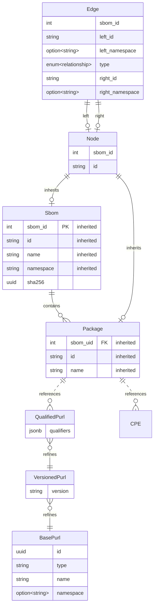

After some tests, here's an update:

Most notable changes:

* We keep an "SBOM ID" which we assign to ensure we can use multiple versions of SBOMs using the same namespace
* Drop the "describes" tables, as those come with the "describes" relationship
* Create a common `sbom_node` table, having `sbom` and `sbom_package` inherit from those
* Have the `package_relates_to_package` reference entries in `sbom_node`

Unresolved issues:

* A relationship can point outside the current SBOM. That's indicated by the `left_namespace` and `right_namespace`:
  * It might be that both ends are external to this document. I don't think we should support this, even if the spec might.
  * How do we handle the case where the relationship points to a target for which we have multiple SBOMs?
